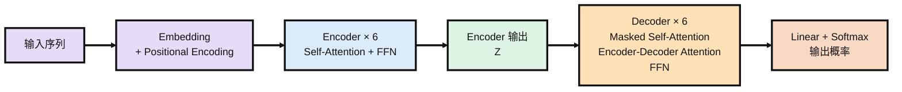
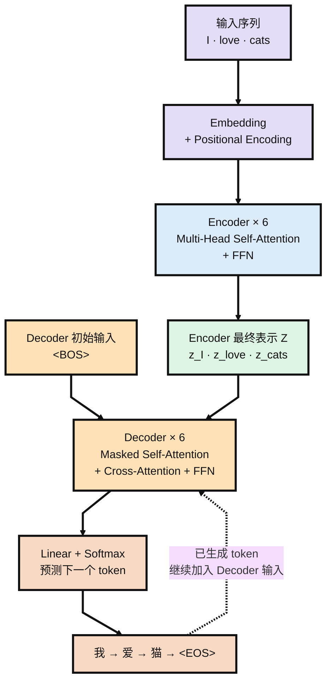
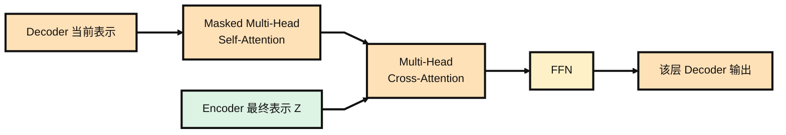
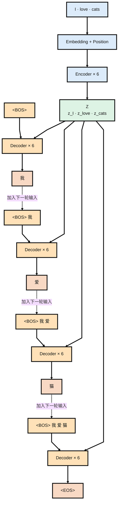
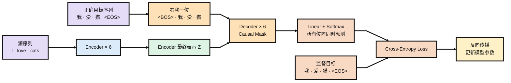

本文是对 *Attention Is All You Need* 的精读笔记。本文按照论文的结构，依次梳理其研究动机，模型架构中的Encoder-Decoder、Self-Attention、Multi-Head Attention、三种 attention、前馈网络与位置编码、残差连接等、Self-Attention 优势论证，训练配置与实验结果，搭配了案例理解原理。

<!-- more -->

论文链接：

[Attention Is All You Need](https://arxiv.org/pdf/1706.03762)

## 研究背景

在 Transformer 提出之前，序列建模的主流方法是 RNN，包括 LSTM、GRU 等变体。它们按照位置顺序递归计算隐藏状态 $h_t = f(h_{t-1}, x_t)$。

这种结构存在两个根本性缺陷。第一，无法并行计算，必须等前一步计算完成后才能继续计算下一步，因此训练效率较低。第二，长程依赖难以捕捉。两个距离较远的位置之间，信息需要经过多步传递，传播路径越长，信息越容易衰减。

Transformer 的核心思想是彻底舍弃循环和卷积结构，完全依靠 attention 机制建模序列中任意两个位置之间的依赖关系，从而同时解决并行计算和长程依赖这两个问题。

## 模型架构与核心原理

Transformer 仍然采用机器翻译中常见的 Encoder-Decoder 结构。Encoder 接收输入序列并将其编码为一组连续表示，Decoder 在这些表示的基础上自回归地生成输出序列。与此前模型不同的是，Transformer 不再使用 RNN 或 CNN 进行序列建模，而是将 Attention 作为 Encoder 和 Decoder 中最主要的信息交互方式。

整个模型由 6 层 Encoder 和 6 层 Decoder 堆叠而成。Encoder 负责不断更新输入序列中每个位置的表示，Decoder 一方面建模已经得到的输出序列，另一方面通过 Encoder-Decoder Attention 读取 Encoder 的结果，最后经过 Linear 和 Softmax 得到下一个 token 的概率分布。



### Encoder-Decoder

Encoder 由 6 个结构相同的 Encoder Layer 堆叠而成，每一层包含两个主要模块：Multi-Head Self-Attention 和 Position-wise Feed-Forward Network。Self-Attention 负责让序列中的不同位置交换信息，FFN 则分别对每个位置的表示进行进一步变换。两个模块外都带有 Residual Connection 和 LayerNorm。

第一层 Encoder 接收输入 token 的 Embedding 与 Positional Encoding 之和，后续每一层则以前一层的输出作为输入。经过 6 层之后得到一组连续表示 $Z=(z_1,z_2,\ldots,z_n)$。

这组表示会被提供给 Decoder。由于 Encoder 中每一层的 Self-Attention 都允许一个位置关注输入中的所有位置，因此最终的 $z_i$ 已经不是单独第 $i$ 个 token 的表示，而是融合了整个输入序列上下文之后的结果。

Decoder 同样由 6 层组成，但每个 Decoder Layer 比 Encoder 多一个 Attention 模块。首先是 Masked Multi-Head Self-Attention，用来建模已经得到的输出序列；随后是 Encoder-Decoder Attention，用来读取 Encoder 的输出；最后再经过 FFN。三个子层同样都使用 Residual Connection 和 LayerNorm。

Decoder 最后一层的输出经过 Linear 映射到词表大小，再通过 Softmax 转换成概率分布，从而预测下一个 token。这个生成过程本身会在后面的完整例子中再展开，这里主要关注 Transformer 内部各个模块是怎样组成的。

### Attention

Attention 是 Transformer 中最核心的计算机制。论文将 Attention 描述为从一个 Query 和一组 Key-Value Pair 到输出的映射：Query 与不同 Key 的匹配程度决定对应 Value 应该获得多大的权重，最终输出则是这些 Value 的加权和。

Transformer 使用的具体形式是 Scaled Dot-Product Attention，并进一步通过 Multi-Head Attention 将这一计算扩展到多个不同的表示子空间。

#### Scaled Dot-Product Attention

Scaled Dot-Product Attention 的公式为 $\operatorname{Attention}(Q,K,V)=\operatorname{softmax}\left(\frac{QK^T}{\sqrt{d_k}}\right)V$，其中 Query 和 Key 的维度为 $d_k$，Value 的维度为 $d_v$。

$QK^T$ 首先计算所有 Query 与所有 Key 之间的点积，得到不同位置之间的匹配分数。由于实际计算时会同时处理一组 Query、Key 和 Value，因此这里可以直接通过矩阵乘法一次得到全部位置之间的关系。

随后将点积结果除以 $\sqrt{d_k}$。论文指出，当 $d_k$ 较大时，点积结果的绝对值也容易随之增大，使 Softmax 落入梯度很小的区域，因此通过这一缩放因子控制数值范围。

经过 Softmax 后，每个 Query 都得到一组归一化的 Attention Weight。最后再用这些权重对 Value 进行加权求和，就得到这个位置新的表示。

因此 Q、K 和 V 承担的作用并不相同。Q 和 K 用来计算不同位置之间应该建立多强的联系，V 则包含最终被读取和重新组合的信息。Attention 的核心也不是选择一个唯一的位置，而是根据输入动态决定不同 Value 在当前输出中各自占多大比重。

#### Multi-Head Attention

论文没有直接使用一组 $d_{\text{model}}$ 维的 Q、K、V 完成一次 Attention，而是分别对 Q、K、V 进行多组不同的线性投影，再在这些投影后的表示上并行计算 Attention。

第 $i$ 个 Attention Head 定义为 $\operatorname{head}_i=\operatorname{Attention}\left(QW_i^Q,KW_i^K,VW_i^V\right)$。

所有 Head 的结果随后被拼接起来，再经过一次线性投影，即 $\operatorname{MultiHead}(Q,K,V)=\operatorname{Concat}(\operatorname{head}_1,\ldots,\operatorname{head}_h)W^O$。

原始 Transformer 使用 8 个 Attention Head，并设置 $d_{\text{model}}=512$，$d_k=d_v=64$。

这里比较容易混淆的是，Multi-Head Attention 并不是把原来的 512 维表示直接切成 8 个固定区域。每个 Head 都有自己独立学习的 $W_i^Q$、$W_i^K$ 和 $W_i^V$，因此会从完整输入表示中投影出一组自己的 64 维 Q、K、V。

不同 Head 因为使用不同的投影参数，可以在不同表示子空间中学习不同的 Attention 关系。8 个 Head 各自得到 64 维输出，拼接后重新得到 512 维表示，再通过 $W^O$ 进行融合。论文认为，这样能够让模型同时关注不同位置、不同表示子空间中的信息，而不是把所有关系都压缩到一次 Attention 中。

这些 Head 只属于当前的 Multi-Head Attention 模块。下一层 Transformer 会使用自己的参数重新计算新的 Q、K、V，因此不同层中的 Head 也是彼此独立学习的。

#### Transformer 中的三种 Attention

Scaled Dot-Product Attention 定义了 Attention 的具体计算方式，Multi-Head Attention 则把这一计算扩展到多个表示子空间。在 Transformer 的实际结构中，同样的 Multi-Head Attention 又根据 Q、K、V 的来源以及是否加入 Mask，被使用在三个不同的位置。

| Attention                     | Query   | Key / Value | 作用                               |
| ----------------------------- | ------- | ----------- | ---------------------------------- |
| Encoder Self-Attention        | Encoder | Encoder     | 建模输入序列内部关系               |
| Decoder Masked Self-Attention | Decoder | Decoder     | 建模已有输出，同时阻止访问未来位置 |
| Encoder-Decoder Attention     | Decoder | Encoder     | 根据 Decoder 当前状态读取输入信息  |

Encoder Self-Attention 中，Q、K、V 都来自前一层 Encoder 的输出，因此每个位置都可以关注前一层中的所有位置。第一层的 Q、K、V 则由加入位置编码后的输入表示产生。

Decoder Masked Self-Attention 的 Q、K、V 同样来自 Decoder，但会额外加入 Mask，使第 $i$ 个位置只能访问当前位置以及之前的位置。实现时，未来位置对应的 Attention Score 会在 Softmax 之前被设为 $-\infty$，因此最终权重变为 0。这样可以保证模型在预测当前位置时不会提前使用未来输出的信息。

Encoder-Decoder Attention 后来通常也称为 Cross-Attention。这里的 Query 来自 Decoder，而 Key 和 Value 来自 Encoder 最终输出 $Z$。因此 Decoder 可以根据当前的表示与 Encoder 中不同位置进行匹配，并从输入序列中读取当前预测需要的信息。

三者并不是三套不同的 Attention 数学机制。它们底层使用的仍然是相同的 Scaled Dot-Product Attention 和 Multi-Head Attention，区别主要在于 Q、K、V 来自哪里，以及是否需要 Mask。

### Transformer 的其他组成

除了 Attention 之外，Transformer 还包含 FFN、Embedding、Positional Encoding、Residual Connection 和 LayerNorm。这些部分并不是论文最主要的创新，但共同构成了完整的网络结构。

**FFN**

每一层 Encoder 和 Decoder 都包含一个 Position-wise Feed-Forward Network。它由两次线性变换和中间的 ReLU 组成，即 $\operatorname{FFN}(x)=\max(0,xW_1+b_1)W_2+b_2$。原始 Transformer 中输入和输出维度都是 512，中间隐藏层维度为 2048。

所谓 Position-wise，是指 FFN 会分别作用于序列中的每一个位置，同一层中所有位置共享相同的 FFN 参数，但不同 Transformer Layer 使用不同参数。因此 Attention 负责不同位置之间的信息交互，而 FFN 本身不再混合位置，只对每个位置已经获得的表示进行独立变换。

**Embedding 与输出层**

输入和输出 token 首先都会通过 learned embedding 转换为 $d_{\text{model}}=512$ 维向量。Decoder 最终得到的隐藏表示则经过一个线性变换映射到词表维度，再通过 Softmax 得到下一个 token 的概率。

论文采用了参数共享，即全局使用一致的文本-向量转换，Encoder Embedding、Decoder Embedding 和最终 Softmax 之前的线性变换共享同一套权重矩阵。在 Embedding 中使用这组权重时，还会额外乘以 $\sqrt{d_{\text{model}}}$。

**Positional Encoding**

由于 Transformer 完全舍弃了 recurrence 和 convolution，模型本身没有通过计算顺序获得 token 位置信息，因此作者额外向输入表示中加入 Positional Encoding。位置编码与 Embedding 具有相同的 $d_{\text{model}}$ 维度，两者可以直接相加。

原始 Transformer 使用不同频率的正弦和余弦函数：$PE_{(pos,2i)}=\sin\left(\frac{pos}{10000^{2i/d_{\text{model}}}}\right)$，$PE_{(pos,2i+1)}=\cos\left(\frac{pos}{10000^{2i/d_{\text{model}}}}\right)$。其中 $pos$ 表示序列位置，$i$ 表示表示向量中的维度。不同维度使用不同频率，使不同位置具有不同的位置表示。

作者选择这种形式的一个考虑是，对于固定的位置偏移 $k$，$PE_{pos+k}$ 可以表示为 $PE_{pos}$ 的线性函数，因此可能更容易学习相对位置关系。论文同时测试了 learned positional embedding，两者实验结果基本相同，最终选择正弦位置编码，是因为作者认为它可能更容易泛化到训练时没有见过的更长序列。

**Residual Connection 与 LayerNorm**

Transformer 在每一个子层外都加入了 Residual Connection，并在残差相加之后进行 LayerNorm，即 $\operatorname{LayerNorm}\left(x+\operatorname{Sublayer}(x)\right)$。这里的 Sublayer 可以是 Multi-Head Attention 或 FFN。Residual Connection 使子层学习到的结果不会直接替代原始表示，而是在原输入的基础上进行更新；LayerNorm 则用于对得到的表示进行归一化。

由于残差连接要求输入 $x$ 和子层输出具有相同维度，因此 Transformer 中各个子层以及 Embedding 的输出都统一保持 $d_{\text{model}}=512$。原始论文采用的是先进行子层计算和残差相加、再进行 LayerNorm 的结构，也就是后来通常所说的 Post-Norm。

### Self-Attention的优势

前面介绍了 Transformer 如何使用 Self-Attention 完成序列中的信息交互，论文随后进一步讨论了为什么选择 Self-Attention 来替代此前常用的 RNN 和 CNN。作者主要从三个方面进行比较：每一层的计算复杂度、能够并行处理的程度，以及序列中不同位置之间的信息传播路径长度。

论文中的比较结果如下：

| Layer Type                | Complexity per Layer | Sequential Operations | Maximum Path Length |
| ------------------------- | -------------------- | --------------------- | ------------------- |
| Self-Attention            | $O(n^2d)$            | $O(1)$                | $O(1)$              |
| Recurrent                 | $O(nd^2)$            | $O(n)$                | $O(n)$              |
| Convolutional             | $O(knd^2)$           | $O(1)$                | $O(\log_k n)$       |
| Restricted Self-Attention | $O(rnd)$             | $O(1)$                | $O(n/r)$            |

其中 $n$ 表示序列长度，$d$ 表示每个位置的表示维度，$k$ 表示卷积核大小，$r$ 表示受限 Self-Attention 中每个位置能够关注的邻域大小。

首先从计算复杂度来看，Self-Attention 每层需要计算序列中不同位置之间的 Attention，因此复杂度为 $O(n^2d)$；RNN 每个位置都需要对 $d$ 维隐藏表示进行变换，复杂度为 $O(nd^2)$。因此 Self-Attention 并不是在任何情况下都具有更低的理论计算量。当序列长度满足 $n<d$ 时，$n^2d<nd^2$，Self-Attention 才会比 Recurrent Layer 更有优势。论文指出，在当时机器翻译模型使用的 sentence representation 中，序列长度通常确实小于表示维度，因此这一条件在实际任务中比较常见。

Self-Attention 更明显的优势在于并行性。RNN 的隐藏状态满足类似 $h_t=f(h_{t-1},x_t)$ 的递归关系，第 $t$ 个位置必须等待第 $t-1$ 个位置计算完成，因此处理长度为 $n$ 的序列至少需要 $O(n)$ 次顺序计算。Self-Attention 则可以把所有位置的 Query、Key 和 Value 组织成矩阵，通过一次矩阵运算同时计算不同位置之间的 Attention，因此一层内部所需要的顺序操作数为 $O(1)$。这里的 $O(1)$ 并不是说整个 Transformer 只有一步计算，而是说一层 Self-Attention 内部的串行步骤不会随着序列长度 $n$ 增长。不同 Transformer Layer 之间仍然需要依次计算，但同一层中的所有序列位置可以并行处理。这也是 Transformer 相比 RNN 更适合利用 GPU 进行大规模矩阵计算的重要原因。

第三个比较标准是长程依赖的信息传播路径。论文认为，一个位置的信息需要经过的中间计算步骤越少，模型就越容易学习两个远距离位置之间的依赖关系。在 RNN 中，一个位置的信息要影响距离较远的另一个位置，需要沿隐藏状态逐步传播，因此两个位置之间的最大路径长度为 $O(n)$。序列越长，远距离信息需要经过的中间步骤也越多。Self-Attention 则允许任意两个位置在同一层中直接建立联系。无论两个 token 在序列中相邻，还是相隔几十个位置，它们都可以通过一次 Attention 直接交换信息，因此最大路径长度为 $O(1)$。这也是论文认为 Self-Attention 更适合学习长程依赖的主要原因之一。

卷积网络同样可以并行计算，但单个卷积层通常只能连接局部位置。如果卷积核宽度为 $k<n$，一个位置需要经过多层卷积才能获得远距离位置的信息。对于普通连续卷积，需要堆叠约 $O(n/k)$ 层才能连接任意两个位置；使用 dilated convolution 时，这一路径可以缩短到 $O(\log_k n)$，但仍然长于 Self-Attention 的直接连接。卷积层本身的计算开销也比较高。普通卷积的复杂度为 $O(knd^2)$，论文指出通常会比 Recurrent Layer 多出约一个与卷积核大小 $k$ 有关的因子。使用 separable convolution 可以将复杂度降低到 $O(knd+nd^2)$；即使令 $k=n$，其计算复杂度也大致相当于 Transformer 中一个 Self-Attention Layer 与一个 Position-wise FFN 的组合。

当然，Self-Attention 的 $O(n^2d)$ 复杂度意味着，当序列非常长时，两两位置之间的 Attention 计算也会变得昂贵。论文因此提出，可以把每个位置的 Attention 限制在大小为 $r$ 的局部邻域内，使计算复杂度下降到 $O(rnd)$。代价是任意两个位置之间不再能够直接连接，最大路径长度会增加到 $O(n/r)$。作者在论文中将这种 Restricted Self-Attention 作为未来值得继续研究的方向。

除了计算复杂度、并行性和路径长度之外，论文还提到 Self-Attention 可能带来一定的可解释性。作者观察模型学习得到的 Attention Distribution 后发现，不同 Attention Head 会表现出不同的行为，其中一些 Head 的 Attention Pattern 与句子的句法和语义结构存在明显联系。例如部分 Head 会关注长距离依赖，另一些 Head 则表现出与指代关系等语言结构相关的模式。

因此，论文选择 Self-Attention 并不是因为它在所有指标上都拥有更低的计算复杂度，而是因为它在当时典型的机器翻译序列长度下具有较好的计算效率，同时能够把序列位置之间的串行计算从 $O(n)$ 降到 $O(1)$，并将任意两个位置之间的信息传播路径缩短到 $O(1)$。相比 RNN 的顺序递归和 CNN 的局部信息传播，Self-Attention 使整个序列能够并行计算，并让远距离位置直接交换信息，这构成了 Transformer 用 Attention 取代 recurrence 和 convolution 的主要理由。

## Transformer 翻译样例

前面分别介绍了 Encoder、Self-Attention、Multi-Head Attention、FFN 等主要模块，但这些部分真正拼在一起之后，数据究竟如何从输入一路走到最终输出，其实并不那么直观。这里就用一次完整的机器翻译过程，把前面那些模块重新串起来看一遍。

假设一个已经训练好的 Transformer 收到英文输入：

```text
I love cats
```

希望最终生成中文：

```text
我 爱 猫
```

整个过程可以分成两个阶段：Encoder 先对完整输入序列做一次编码，把每个 token 变成融合了上下文的表示；Decoder 再以这些表示为条件，从 `<BOS>` 开始逐步预测目标序列中的下一个 token，直到生成 `<EOS>`。



### Encoder

输入序列先经过 token embedding，再与对应的位置编码相加。原始 Transformer 的模型维度是 $d_{\text{model}}=512$，所以 `I`、`love` 和 `cats` 各自得到一个 512 维的向量，合在一起就是 $X^0\in\mathbb R^{3\times512}$。这 3 对应序列里的三个位置。随后 $X^0$ 会依次进入由 6 个结构相同、参数独立的 Encoder Layer 组成的堆叠。

在第一个 Encoder Layer 里，$X^0$ 先进入 Multi-Head Self-Attention。原始模型使用 8 个 head，每个 head 都从完整的 512 维表示出发，通过自己独立的线性投影得到 64 维的 Query、Key 和 Value。第 $i$ 个 head 可以写成

$$
Q_i=X^0W_i^Q,\quad
K_i=X^0W_i^K,\quad
V_i=X^0W_i^V
$$

然后计算

$$
\operatorname{Attention}(Q_i,K_i,V_i)
=
\operatorname{softmax}
\left(
\frac{Q_iK_i^T}{\sqrt{d_k}}
\right)V_i
$$

因为输入只有三个位置，$Q_iK_i^T$ 会得到一个 $3\times3$ 的矩阵，本质上就是当前 head 里三个 token 两两之间的匹配程度。以 `love` 这个位置为例，它会用自己的 Query 去和 `I`、`love`、`cats` 三个位置的 Key 做匹配。经过 scale 和 Softmax 之后，假设某个 head 得到的权重是 0.30、0.20、0.50，那么这个 head 对 `love` 的新表示就是三个 Value 按这个权重的加权和。Self-Attention 并不是简单地挑一个最相关的 token，而是根据当前输入动态算出一组权重，再按这些权重把不同位置的 Value 重新混合起来。

8 个 head 并行做同样的事，但由于各自的投影矩阵不同，它们其实是在不同的低维空间里观察 token 之间的关系。把 8 个 head 的 $3\times64$ 输出拼接回去，重新得到 $3\times512$ 的表示，再经过输出投影矩阵 $W^O$ 做一次融合。

Multi-Head Attention 之后是残差连接和 LayerNorm，然后进入 position-wise 的 FFN。原始 Transformer 里 FFN 对每个位置单独做一次 $512\rightarrow2048\rightarrow\operatorname{ReLU}\rightarrow512$ 的变换。可以把一个 Encoder Layer 简单理解成：Attention 负责不同位置之间交换信息，FFN 负责每个位置自己加工当前的表示。

第一个 Encoder Layer 结束后得到 $X^1$，它继续进入第二个 Encoder Layer。上一层内部算出来的 Q、K、V 并不会直接传下去，第二层接收的是新的 $X^1$，再用这一层自己的参数重新生成 Q、K、V。整个 Encoder 就是这样一层一层往下走：$X^0$ 经过第 1 层得到 $X^1$，再经过第 2 层得到 $X^2$，一直到第 6 层，最终得到 $Z=X^6$。

最终得到的 $Z=[z_I,z_{\text{love}},z_{\text{cats}}]$ 里，三个输入位置仍然完整保留，每个位置还是一个 512 维表示，只是已经经过六轮 Self-Attention 和 FFN，不再是最初孤立的词向量，而是融合了整个输入序列上下文之后的表示。此时的 $z_{\text{love}}$ 里已经包含了模型从 `I` 和 `cats` 等位置交互过来的信息。

需要特别注意的是，Encoder 最终交给 Decoder 的并不是某一层 Attention 内部用过的 Q、K、V，而是第 6 层最终得到的 $Z$。Q、K、V 只是每一层 Attention 内部为了计算信息交换方式而临时产生的中间量。

### Decoder

Encoder 只需要对输入序列计算一次。得到 $Z$ 之后，在之后生成整个目标序列的过程中，源序列不会再变，因此同一个 $Z$ 会一直作为 Decoder Cross-Attention 的信息来源。

最开始目标侧还没有任何实际 token，所以先向 Decoder 输入起始符 `<BOS>`。它同样经过 embedding 和位置编码，得到一个 512 维表示，进入 Decoder 第 1 层。

每个 Decoder Layer 包含三个主要模块：Masked Multi-Head Self-Attention、Cross-Attention、FFN，每个子层之后同样有残差连接和 LayerNorm。



首先是 Masked Self-Attention。因为此时目标侧只有 `<BOS>` 一个位置，它暂时没有其他历史 token 可以读取，只能关注自己。经过这一部分以及对应的 Add & Norm 后，得到 `<BOS>` 当前新的表示。

随后进入 Cross-Attention。这里 Q、K、V 的来源和 Self-Attention 不同：Query 来自 Decoder 当前的表示，Key 和 Value 来自 Encoder 最终表示 $Z$。Decoder 的 Cross-Attention 有自己独立的投影参数，会根据当前层的需要重新把 Decoder 表示投影成 Query，把 $Z$ 投影成 Key 和 Value。以第 $i$ 个 head 为例，

$$
Q_i=AW_i^Q,\quad
K_i=ZW_i^K,\quad
V_i=ZW_i^V
$$

其中 $A$ 是经过当前 Decoder Masked Self-Attention 后得到的表示。Decoder 的 Query 会与 `I`、`love`、`cats` 对应的 Key 做匹配，得到一组权重，再按这些权重从 Encoder 提供的 Value 里读取信息。真正的 attention 权重由输入内容、Decoder 当前状态和已经学到的参数共同决定，不同 head、不同层完全可以形成不一样的分布。

Cross-Attention 得到的信息经过残差和 LayerNorm 后进入 FFN。到这里，Decoder 第 1 层处理结束，只得到一个新的隐藏表示，此时模型还没有生成“我”。

这个表示会继续进入第 2 层，第 2 层重新执行自己独立的 Masked Self-Attention、Cross-Attention 和 FFN，并再次读取同一个 $Z$。虽然各层读到的原始 $Z$ 相同，但不同层有自己的投影参数，实际得到的 Query、Key、Value 以及最终读到的信息都可以不同。这个过程一直重复到第 6 层，只有完整经过 6 个 Decoder Layer 之后，最终的隐藏表示才会被送入输出层。

原始 Transformer 先通过一个 Linear 把 512 维隐藏表示映射到整个目标词表（假设词表大小是 50,000），得到 50,000 个 logits，再经过 Softmax 转成概率分布。模型据此预测出第一个 token：`我`。

从这个角度看，Decoder 最终做的其实是一次针对整个目标词表的 next-token prediction。前面的 Masked Self-Attention、Cross-Attention、FFN 和多层变换，都是在不断构造一个更适合当前预测的隐藏表示，而最后的 Linear + Softmax 始终在回答同一个问题：在当前输入序列和已经生成的目标序列条件下，下一个 token 最应该是什么？

第一个 token `我` 生成之后，会被加入 Decoder 输入，下一轮变成 `<BOS> 我`。这段目标侧前缀重新完整走一遍 6 层 Decoder。此时 Masked Self-Attention 开始真正利用已经生成的历史：`我` 所在的位置可以读取 `<BOS>` 和自身的信息，而 Cross-Attention 仍然持续读取同一个 $Z$。经过第 6 层后，取最后一个位置对应的隐藏表示，再经 Linear + Softmax，得到第二个 token：`爱`。

之后继续重复同样的过程：先是 `<BOS>` 经过 Decoder 得到 `我`，再把 `我` 拼进去得到 `<BOS> 我`，再经过 Decoder 得到 `爱`；接着是 `<BOS> 我 爱` 得到 `猫`；最后 `<BOS> 我 爱 猫` 得到 `<EOS>`。当模型预测出 `<EOS>` 时，本次翻译结束。

整个生成过程可以进一步表示如下：



从整体数据流来看，一个已经训练完成的 Transformer 可以概括成两部分：Encoder 先对完整输入序列计算一次，通过多轮 Self-Attention 和 FFN 把每个输入 token 变成融合上下文的表示 $Z$；Decoder 随后以已经生成的目标序列和同一个 $Z$ 为条件，通过 Masked Self-Attention、Cross-Attention 和 FFN 逐步形成当前预测位置的隐藏表示，再经过 Linear 和 Softmax 完成一次 next-token prediction。生成出的 token 会继续加入 Decoder 输入，模型重复这一过程，直到预测出 `<EOS>`。

Transformer 虽然消除了 RNN 在序列位置之间的递归计算，使一次前向传播中的不同位置能够并行处理，但实际进行自回归生成时，不同输出 token 之间仍然存在 $y_1\rightarrow y_2\rightarrow y_3\rightarrow\cdots\rightarrow y_T$ 这样的顺序依赖。前面介绍的 Q、K、V、Multi-Head Attention、FFN、Residual 和 LayerNorm，本质上都是为这个过程服务的内部机制——它们不断构造和更新隐藏表示，而 Decoder 最终始终在回答同一个问题：在当前源序列和已有目标序列的条件下，下一个 token 应该是什么。

## Transformer 训练样例

前面的过程描述的是一个已经训练完成的 Transformer 如何根据 `I love cats` 逐步生成 `我 爱 猫`。但模型在训练开始时并不知道英文和中文之间应该如何对应，Embedding、Attention 中的投影矩阵、FFN 以及最终输出层中的参数也还没有学到有意义的数值。因此接下来的问题是：给定大量已经知道正确翻译的平行语料，Transformer 如何通过训练逐渐学会前面的生成过程？这里使用同一个语言翻译样本来进行展示。

推理时，正确的中文翻译事先并不知道，因此 Decoder 必须从 `<BOS>` 开始，一个 token 一个 token 地预测后续内容；训练时则不同，目标序列本身就是已经给出的监督信号，因此模型不仅知道输入是 `I love cats`，也知道正确输出应该是 `我 爱 猫`。

这使得训练阶段不需要像实际生成时那样分别运行 `<BOS>`、`<BOS> 我`、`<BOS> 我 爱` 等多轮 Decoder，而是可以将正确目标序列右移一位后一次输入 Decoder，再通过 Causal Mask 限制每个位置能够读取的信息。这样一次前向传播就可以同时训练多个 next-token prediction，随后根据正确答案计算 Loss，并利用反向传播更新整个模型中的可学习参数。



### 训练样本

源序列一侧与推理阶段没有本质区别。`I`、`love` 和 `cats` 首先经过 Embedding 和 Positional Encoding，再完整经过 6 层 Encoder，最终得到

$$
Z=[z_I,z_{\text{love}},z_{\text{cats}}]
$$

真正不同的是 Decoder 的输入。

目标序列原本是 `我 爱 猫`。为了让模型同时学习什么时候结束，还需要在末尾加入 `<EOS>`，变成：

```text
我 爱 猫 <EOS>
```

训练 Decoder 时，不会直接把这组 token 原样作为输入和预测目标，而是将目标序列整体向右错开一个位置，在最前面加入 `<BOS>`。于是 Decoder 输入变成：

```text
<BOS> 我 爱 猫
```

对应的监督目标则是：

```text
我 爱 猫 <EOS>
```

四个位置因此分别对应四个 next-token prediction：

```text
<BOS>           → 我
<BOS> 我        → 爱
<BOS> 我 爱     → 猫
<BOS> 我 爱 猫  → <EOS>
```

这里有一个和推理阶段非常重要的区别：Decoder 输入里的 `我`、`爱` 和 `猫` 并不是当前模型刚刚预测出来的 token，而是直接来自训练数据中的正确目标序列。

即使模型此时第一个位置更倾向于预测 `你`，第二个位置接收到的历史仍然是训练数据中的正确 token `我`，而不会变成模型自己刚刚预测错误的 `你`。这种在训练时直接使用正确目标序列作为历史输入的方式通常称为 Teacher Forcing。它使模型可以稳定地学习：在正确的目标前缀已经给定时，下一个 token 应该是什么。

不过这又产生了一个新的问题。既然 `<BOS> 我 爱 猫` 在训练时一次全部进入 Decoder，那么如果没有额外限制，`<BOS>` 所在的位置就可能直接读取后面的 `我`、`爱` 和 `猫`，模型甚至可以利用未来答案预测当前位置，这显然与实际生成过程不一致。因此 Decoder 的 Self-Attention 还需要使用 Causal Mask。

对于四个位置，允许读取的信息分别是：

```text
<BOS> 只能读取 <BOS>

我     可以读取 <BOS>、我

爱     可以读取 <BOS>、我、爱

猫     可以读取 <BOS>、我、爱、猫
```

对应的 attention mask 可以写成

$$
M=
\begin{bmatrix}
\checkmark & \times & \times & \times \\
\checkmark & \checkmark & \times & \times \\
\checkmark & \checkmark & \checkmark & \times \\
\checkmark & \checkmark & \checkmark & \checkmark
\end{bmatrix}
$$

实际计算时，被禁止访问的位置会在 Softmax 之前被赋予极小值，通常可以理解为设置成 $-\infty$。由于 $e^{-\infty}=0$，这些位置经过 Softmax 后得到的 attention 权重就会变成 0，因此不会参与 Value 的加权混合。

这样一来，虽然正确目标序列已经完整输入 Decoder，但每个位置实际上仍然只能利用当前及之前的目标 token，无法偷看后面的正确答案。

### 前向传播

经过目标序列右移和 Causal Mask 之后，一次完整的训练前向传播就可以开始。

Encoder 首先将 `I love cats` 处理成固定的源序列表示

$$
Z=[z_I,z_{\text{love}},z_{\text{cats}}]
$$

与此同时，Decoder 一次接收：

```text
<BOS> 我 爱 猫
```

四个 token 都经过 Embedding 和 Positional Encoding，形成

$$
Y^0\in\mathbb R^{4\times512}
$$

随后整个 $Y^0$ 一次进入 Decoder 第 1 层。

Masked Self-Attention 会同时计算四个位置之间允许存在的 attention，只不过 Causal Mask 会禁止当前位置访问未来位置；Cross-Attention 则让四个位置分别使用自己的 Query 读取同一个 Encoder 表示 $Z$；随后各个位置分别经过 FFN。

第 1 层结束之后仍然得到四个位置的表示

$$
Y^1\in\mathbb R^{4\times512}
$$

它们继续进入第 2 层，再依次经过 Masked Multi-Head Self-Attention、Cross-Attention 和 FFN，一直到第 6 层，最终得到

$$
H=[h_1,h_2,h_3,h_4]\in\mathbb R^{4\times512}
$$

这里的四个隐藏表示分别对应 Decoder 输入中的 `<BOS>`、`我`、`爱` 和 `猫`。

随后四个位置都会经过同一个输出 Linear，将 512 维隐藏表示映射到目标词表，并通过 Softmax 得到整个词表上的概率分布。

假设当前模型仍处于训练早期，四个位置分别得到的概率可能还不高，但一次 Decoder 前向传播已经同时完成了四个预测：

$$
P(y_1\mid \texttt{<BOS>})
$$

$$
P(y_2\mid \texttt{<BOS> 我})
$$

$$
P(y_3\mid \texttt{<BOS> 我 爱})
$$

$$
P(y_4\mid \texttt{<BOS> 我 爱 猫})
$$

对应的正确答案则是

$$
y_1=\text{我},\qquad
y_2=\text{爱},\qquad
y_3=\text{猫},\qquad
y_4=\texttt{<EOS>}
$$

这也是 Transformer 训练阶段与实际自回归生成之间一个非常重要的区别。

推理时必须实际执行一步一步的生成，因为后一个输入必须等前一个 token 真正生成出来之后才能确定。训练时正确目标序列已经知道，因此可以一次输入 `<BOS> 我 爱 猫`，再依靠 Causal Mask 将每个位置能够使用的信息限制成对应的前缀。

所以自回归描述的是信息依赖关系必须从左向右，并不意味着训练时的四个位置也必须真的按照时间顺序一个一个计算。通过 Causal Mask，这种因果约束被直接编码进 Attention 矩阵，因此同一层中的不同目标位置仍然可以并行处理。

### 反向传播

完成一次前向传播之后，模型已经在四个位置上分别给出了整个目标词表的概率分布。接下来需要将这些预测与正确目标进行比较，从而判断模型当前预测得有多差。

这条训练样本的正确目标是：

```text
位置 1 → 我
位置 2 → 爱
位置 3 → 猫
位置 4 → <EOS>
```

假设模型给这四个正确 token 的概率分别为

$$
P(\text{我})=0.40,\qquad
P(\text{爱})=0.35,\qquad
P(\text{猫})=0.60,\qquad
P(\texttt{<EOS>})=0.55
$$

如果先使用普通的 Cross-Entropy 来理解，那么每个位置的 Loss 可以写成

$$
L_t=-\log P(y_t)
$$

四个位置的平均 Loss 为

$$
L=
-\frac{1}{4}
\left[
\log0.40+
\log0.35+
\log0.60+
\log0.55
\right]
$$

如果模型给正确 token 的概率很低，例如 $P(\text{爱})=0.01$，那么 $-\log0.01$ 会产生较大的 Loss；如果模型已经非常确定正确答案，例如 $P(\text{爱})=0.95$，对应的 Loss 就会比较小。

因此 Cross-Entropy 实际上在要求模型不断提高正确 next token 的概率，同时降低错误 token 的概率。

实际训练时当然不会只使用 `I love cats → 我 爱 猫` 这一条样本，而是将大量不同长度的翻译样本组成 batch，对其中所有有效目标位置计算 Loss，再对这些 Loss 进行汇总。对于为了组成 batch 而补出的 `<PAD>` 位置，则通常会通过 padding mask 排除，不让它们参与有效预测和 Loss 计算。

得到 Loss 以后，训练还没有结束。Loss 只是衡量当前模型的预测误差，真正让模型发生变化的是随后进行的反向传播。反向传播首先从最终的 Loss 开始，根据链式法则向前计算各个参数对 Loss 的影响。例如某个 Attention head 中

$$
Q=XW^Q,\qquad
K=XW^K,\qquad
V=XW^V
$$

真正需要学习的是 $W^Q$、$W^K$ 和 $W^V$。Loss 经过 Attention 的计算路径反向传播后，可以得到

$$
\frac{\partial L}{\partial W^Q},
\qquad
\frac{\partial L}{\partial W^K},
\qquad
\frac{\partial L}{\partial W^V}
$$

这些梯度描述的是：如果稍微改变当前参数，最终 Loss 会向什么方向变化。同样，FFN 中的 $W_1$、$b_1$、$W_2$、$b_2$，Multi-Head Attention 最后的 $W^O$，以及 Embedding、LayerNorm 和最终输出 Linear 等可学习参数，也都会得到自己的梯度。训练并不是只更新 Decoder。预测误差最初产生在 Decoder 最后的词表概率上，但 Decoder 的 Cross-Attention 使用了 Encoder 最终表示 $Z$。因此梯度会继续沿着 Cross-Attention 向 Encoder 传播，于是 Encoder 六层中的 Self-Attention、FFN 和其他可学习参数也会一起得到梯度。

整个 Transformer 因而形成一条端到端的可微计算链，训练时再沿相反方向计算。最终得到各层参数的梯度。得到梯度以后，优化器再根据这些梯度更新参数。最简单的梯度下降可以表示为 $\theta_{\text{new}}=\theta_{\text{old}}-\eta\frac{\partial L}{\partial\theta}$，其中 $\theta$ 表示模型中的某个可学习参数，$\eta$ 是 learning rate。原始 Transformer 实际使用 Adam 优化器，并配合特定的 learning rate schedule，这些属于训练配置中的具体实现。

完成一次更新后，同一条样本如果再次输入模型，得到的 Attention、隐藏表示和最终词表概率通常都会发生轻微变化。模型不会被直接告诉某个 head 应该负责主语、某个 head 应该负责动词，或者 $W^Q$ 应该变成什么数值。训练提供的监督只有最终目标：`I love cats` 应该预测 `我 爱 猫 <EOS>`。至于中间的 $W^Q$、$W^K$、$W^V$ 应该如何变化，哪些位置应该形成更强的 Attention，不同 head 应该学习什么表示空间，都是模型在不断降低最终 Loss 的过程中通过梯度下降共同形成的。

经过大量不同的平行语料和大量参数更新之后，模型才逐渐从最初没有意义的参数状态变成前一章描述的已经训练好的 Transformer：Encoder 能够形成有用的上下文表示 $Z$，Decoder 的 Cross-Attention 能够根据当前目标前缀读取相关源语言信息，最终输出层也能够逐渐提高正确 next token 的概率。

## 训练与实验结果

在介绍完 Transformer 的模型结构以及 Self-Attention 的设计之后，论文进一步给出了模型实际使用的训练配置，并通过机器翻译、模型变体实验和英语成分句法分析验证 Transformer 的效果。

### 训练配置

**训练数据与 Batching**

机器翻译实验主要使用 WMT 2014 English-German 和 English-French 两个数据集。

English-German 数据集包含大约 450 万对平行句子。论文使用 Byte-Pair Encoding（BPE）对文本进行编码，并在源语言和目标语言之间共享一个约 37,000 个 token 的词表。

English-French 数据集规模更大，包含大约 3600 万对句子，使用约 32,000 个 word-piece 作为词表。

训练时，作者按照近似的序列长度将句子对组织到同一个 batch 中，从而减少不同长度序列进行 padding 带来的额外计算。每个 batch 大约包含 25,000 个 source token 和 25,000 个 target token。

| 数据集                  | 训练规模               | Tokenization | 词表大小                              |
| ----------------------- | ---------------------- | ------------ | ------------------------------------- |
| WMT 2014 English-German | 约 4.5M sentence pairs | BPE          | 约 37K，共享 source-target vocabulary |
| WMT 2014 English-French | 约 36M sentence pairs  | WordPiece    | 约 32K                                |

**硬件与训练时间**

所有模型都在一台包含 8 块 NVIDIA P100 GPU 的机器上训练。

Base Transformer 每个 training step 大约需要 0.4 秒，总共训练 100,000 steps，因此完整训练时间约为 12 小时。Big Transformer 每个 step 大约需要 1 秒，总共训练 300,000 steps，训练时间约为 3.5 天。

| Model            | GPUs     | Step Time | Training Steps | Training Time |
| ---------------- | -------- | --------- | -------------- | ------------- |
| Transformer Base | 8 × P100 | 约 0.4 s  | 100K           | 约 12 h       |
| Transformer Big  | 8 × P100 | 约 1.0 s  | 300K           | 约 3.5 days   |

**Optimizer 与 Learning Rate**

论文使用 Adam Optimizer，并设置 $\beta_1=0.9$、$\beta_2=0.98$、$\epsilon=10^{-9}$。

Learning Rate 并不是保持固定，而是根据训练步数动态变化：

$lrate=d_{\text{model}}^{-0.5}\cdot\min(\text{step_num}^{-0.5},\text{step_num}\cdot\text{warmup_steps}^{-1.5})$

其中 $\text{warmup_steps}=4000$。

因此训练开始后的前 4000 steps 中，Learning Rate 会随着训练步数线性增加；完成 warmup 之后，则按照 step number 的 inverse square root 逐渐下降。这样的设计使模型在训练初期使用较小的更新幅度，之后逐步增大学习率，再随着训练进行逐渐减小。

**Regularization**

论文主要使用 Dropout 和 Label Smoothing 进行正则化。

Residual Dropout 会作用在每个子层的输出上，然后再与子层输入进行残差相加和 LayerNorm。同时，Encoder 和 Decoder 底部的 Embedding 与 Positional Encoding 相加之后也会使用 Dropout。Base Transformer 的 dropout rate 设置为 $P_{\text{drop}}=0.1$。

训练时还使用了 $\epsilon_{ls}=0.1$ 的 Label Smoothing。与严格的 one-hot target 相比，Label Smoothing 会让模型对正确 token 的预测更加保守，因此论文观察到它会使 perplexity 略有变差，但能够提高 accuracy 和 BLEU。

### 实验结果

#### 机器翻译

论文首先在 WMT 2014 English-German 和 English-French 两个机器翻译任务上与此前的 RNN、CNN 以及 Ensemble 模型进行比较。

主要结果如下：

| Model               | EN-DE BLEU | EN-FR BLEU |
| ------------------- | ---------: | ---------: |
| ByteNet             |      23.75 |          - |
| GNMT + RL           |      24.60 |      39.92 |
| ConvS2S             |      25.16 |      40.46 |
| MoE                 |      26.03 |      40.56 |
| GNMT + RL Ensemble  |      26.30 |      41.16 |
| ConvS2S Ensemble    |      26.36 |      41.29 |
| Transformer Base    |      27.30 |      38.10 |
| **Transformer Big** |  **28.40** |  **41.80** |

在 English-German 任务上，Transformer Big 达到 28.4 BLEU，比此前包括 Ensemble 在内的最佳结果高出 2 BLEU 以上，取得新的 state-of-the-art。

值得注意的是，即使是规模较小的 Transformer Base，也已经达到 27.3 BLEU，高于表中此前发表的单模型和 Ensemble，同时训练成本明显更低。

English-French 上，Transformer Big 达到 41.8 BLEU，同样取得了当时非常有竞争力的结果。论文重点强调的不只是最终 BLEU，还包括达到这些结果所需要的训练成本：Transformer 能够利用高度并行的矩阵计算，在远少于此前许多 RNN 和 CNN 模型的训练成本下得到相当甚至更高的翻译质量。

推理时，Base Model 使用最后 5 个 checkpoint 的参数进行平均，这些 checkpoint 之间间隔 10 分钟；Big Model 则平均最后 20 个 checkpoint。

机器翻译使用 Beam Search 生成最终序列，beam size 设置为 4，并使用 length penalty $\alpha=0.6$。最大输出长度被限制为输入长度加 50，但如果提前生成 `<EOS>`，则会直接结束生成。

#### 模型变体与消融实验

论文随后在 WMT 2014 English-German 的 development set 上修改 Transformer 的不同组成部分，观察模型结构和超参数变化对结果的影响。

Base Transformer 的主要配置为：

| 参数                         | Base Transformer |
| ---------------------------- | ---------------- |
| Encoder / Decoder Layers $N$ | 6                |
| $d_{\text{model}}$           | 512              |
| $d_{\text{ff}}$              | 2048             |
| Attention Heads $h$          | 8                |
| $d_k$                        | 64               |
| $d_v$                        | 64               |
| $P_{\text{drop}}$            | 0.1              |
| $\epsilon_{ls}$              | 0.1              |
| Training Steps               | 100K             |
| Parameters                   | 约 65M           |

作者首先改变 Attention Head 的数量，同时调整每个 Head 的 $d_k$ 和 $d_v$，使整体计算量大致保持不变。

实验发现，Single-Head Attention 的 BLEU 比最佳设置低约 0.9，说明使用多个 Attention Head 确实能够提升模型质量；但 Head 数量也不是越多越好，当 Head 继续增加时，性能同样会有所下降。

论文还单独减小了 Attention Key 的维度 $d_k$，结果发现较小的 $d_k$ 会降低模型性能。作者据此认为，判断 Query 与 Key 之间的 compatibility 并不是一个非常简单的问题，更大的 Key Representation 能够提供更充分的匹配信息。

模型规模实验则表现出比较明确的趋势：增加 Transformer Layer 数量、提高 $d_{\text{model}}$ 或增大 FFN 中间层维度 $d_{\text{ff}}$，通常都能够继续改善结果，但同时也会明显增加参数量。

Dropout 的实验也说明正则化对于 Transformer 的训练十分重要。取消 Dropout 后模型更容易出现过拟合，而适当使用 Dropout 可以明显改善 development set 上的表现。

Positional Encoding 方面，作者还将原本的 sinusoidal positional encoding 替换为 learned positional embedding。两种方法最终得到的结果几乎相同，说明 Transformer 的性能并不强依赖正弦位置编码本身。论文最终仍然选择 sinusoidal positional encoding，主要是因为作者认为它可能更容易泛化到训练阶段没有出现过的更长序列。

Big Transformer 则进一步扩大模型规模，主要配置为 $N=6$、$d_{\text{model}}=1024$、$d_{\text{ff}}=4096$、$h=16$，参数量增加到约 213M，并训练 300K steps。

整体来看，这组模型变体实验说明 Multi-Head Attention、足够大的 Attention Representation、模型容量以及 Dropout 都会影响最终性能，而 learned positional embedding 与 sinusoidal positional encoding 的结果则基本相同。

#### English Constituency Parsing

为了验证 Transformer 是否只能用于机器翻译，论文进一步将模型应用到了 English Constituency Parsing，也就是英语成分句法分析任务。

这一任务与机器翻译存在明显差异：输出需要满足较强的句法结构约束，而且生成的输出序列通常比输入序列明显更长。因此，这个实验主要用于检验 Transformer 能否泛化到具有不同输出结构的 sequence transduction task。

作者使用 Penn Treebank 中 Wall Street Journal（WSJ）部分的数据进行实验，其中只有大约 40K 条训练句子。同时还进行了 semi-supervised 实验，引入更大规模的额外语料。

这里使用的是一个 4-layer Transformer，并设置 $d_{\text{model}}=1024$。

主要实验结果如下：

| Parser                     | Training                     | WSJ 23 F1 |
| -------------------------- | ---------------------------- | --------: |
| Vinyals & Kaiser et al.    | WSJ only, discriminative     |      88.3 |
| Petrov et al.              | WSJ only, discriminative     |      90.4 |
| Zhu et al.                 | WSJ only, discriminative     |      90.4 |
| Dyer et al.                | WSJ only, discriminative     |  **91.7** |
| **Transformer (4 layers)** | **WSJ only, discriminative** |  **91.3** |
| Zhu et al.                 | semi-supervised              |      91.3 |
| Huang & Harper             | semi-supervised              |      91.3 |
| McClosky et al.            | semi-supervised              |      92.1 |
| Vinyals & Kaiser et al.    | semi-supervised              |      92.1 |
| **Transformer (4 layers)** | **semi-supervised**          |  **92.7** |
| Luong et al.               | multi-task                   |      93.0 |
| Dyer et al.                | generative                   |      93.3 |

只使用大约 40K 条 WSJ 训练句子时，Transformer 已经取得 91.3 F1。虽然略低于 Dyer et al. 的 91.7，但已经超过包括 BerkeleyParser 在内的大多数此前方法。

在 semi-supervised 设置下，Transformer 进一步达到 92.7 F1，只低于表中的 multi-task 和 generative 方法。

这一实验中作者并没有针对 constituency parsing 对 Transformer 结构进行大量特殊设计，整体参数基本沿用机器翻译模型，只对少量 dropout、learning rate 和 beam size 等配置进行了选择。推理阶段最大输出长度被增加到输入长度加 300，beam size 设置为 21，length penalty 设置为 $\alpha=0.3$。

因此，论文认为这一结果说明 Transformer 并不局限于机器翻译。即使面对输出具有严格结构约束、输出长度明显不同，并且训练数据规模较小的任务，基于 Self-Attention 的架构仍然能够取得具有竞争力的结果。

整体来看，实验结果验证了论文前面对 Transformer 的主要论证：相比此前基于 recurrence 或 convolution 的 sequence transduction model，Transformer 不仅能够取得更好的机器翻译质量，还能够利用更强的并行性显著降低训练时间；与此同时，在 English Constituency Parsing 上的结果也说明这一架构能够泛化到机器翻译之外的其他序列转换任务。

## 总结

Transformer 是第一个完全基于注意力机制的序列模型，用 Multi-Head Self-Attention 替代了 encoder-decoder 架构中最常用的循环层。在 WMT 2014 英译德、英译法两个翻译任务上，Transformer 都取得了当时的最优结果，且训练速度远快于以往基于循环或卷积结构的模型。论文还通过英语成分句法分析任务的实验，验证了 Transformer 具备良好的任务泛化能力，即便在小数据量场景下也能取得有竞争力的结果，说明这一架构不局限于机器翻译。

作者在结论部分提到几个计划推进的方向：一是将 Transformer 拓展到文本以外的输入输出模态，如图像、音频、视频等；二是研究局部的、受限的注意力机制，以高效处理超长序列的输入输出；三是探索让生成过程更少依赖串行步骤的方法。这几个方向后来都在深度学习的发展中得到了印证：ViT 把 attention 用到了图像上，各类高效注意力针对长序列做了优化，扩散模型等非自回归生成方式减少串行依赖。
