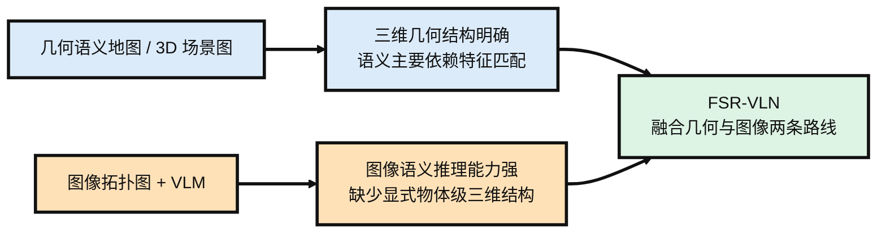
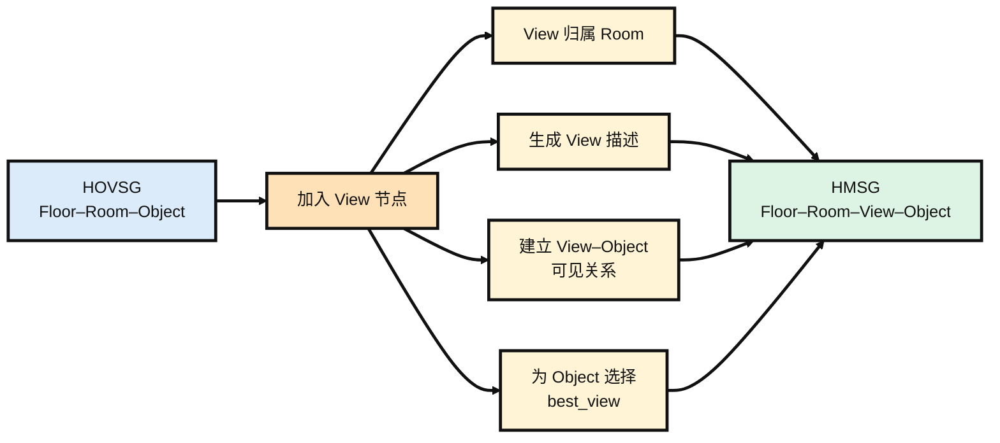
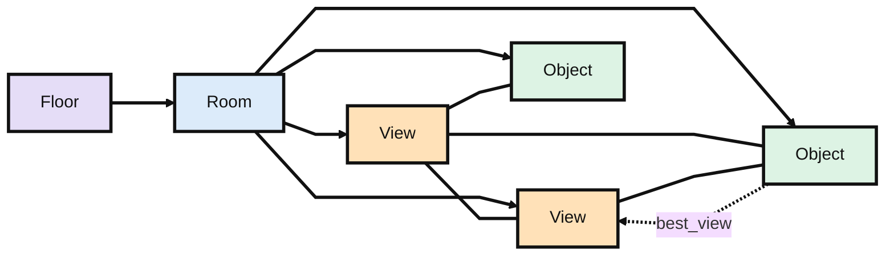
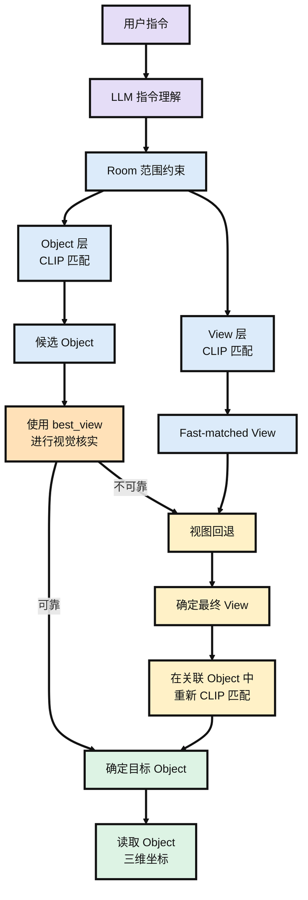

八月初启，暑色未收，秋意已在风里。许多新的问题也像尚未翻开的书页一样，安静地等在前面。此刻并不急着知道它们最终会通向哪里，只愿在一次次阅读、推演与尝试之间，渐渐看清一些东西，也渐渐发现更多值得追问的方向。山长水阔，且从这一卷开始。

<!-- more -->
## FSR-VLN: 融合几何与图像两条路线的快慢推理VLN

论文链接：

[FSR-VLN Fast and Slow Reasoning for Vision-Language Navigation with Hierarchical Multi-modal Scene Graph](https://arxiv.org/abs/2509.13733)

### 研究背景

FSR-VLN 研究的是在离线场景图已经构建完成的条件下，如何根据用户指令找到目标物体。系统的输入是一条文本或语音指令，输出则是目标物体对应的视图节点以及它在场景中的三维坐标。也就是说，这篇论文主要关注的是建图完成之后的目标理解、检索和定位，而不是在线探索或实时建图。

现有方法大致可以分成两条路线。一类是 OK-Robot、HOVSG 这样的几何语义地图或 3D 场景图，把 CLIP、OWL-ViT 等视觉模型的特征存到体素或物体节点中，检索时直接计算指令文本和节点特征之间的相似度。这类方法有明确的三维几何表示，目标一旦匹配到物体节点，就比较容易得到空间位置，但对目标的理解主要依赖 embedding 匹配。另一类方法则把环境表示成由历史图像组成的拓扑图，再直接利用 VLM 或长上下文模型在图像序列中寻找目标，语义推理能力更强，但缺少显式的物体级三维几何表示。FSR-VLN 想做的就是把这两种表示结合起来：既保留场景图中的几何和物体信息，也保留原始图像供 VLM 做进一步判断，因此在原有的 Floor–Room–Object 结构中加入了 View 节点，形成后面的 HMSG。两条路线和本文脉络如下所示。

### HMSG

FSR-VLN 使用的是 Hierarchical Multi-modal Scene Graph（HMSG）。它并不是从头设计一种新的地图表示，而是在 HOVSG 原有的 Floor–Room–Object 三层场景图中加入了一层 View，用 View 把原始图像和三维物体连接起来。整体关系可以理解为 Floor 下面包含 Room，每个 Room 下面同时包含 View 和 Object；View 与它能够观测到的 Object 之间建立可见关系，不同 View 之间则根据相对位姿建立拓扑连接。这样一来，Floor 和 Room 仍然负责组织空间层级，Object 保留具体物体的三维包围盒、点云和语义特征，而 View 则保留机器人历史观测到的图像、相机位姿、CLIP 特征以及 VLM 生成的文字描述。

HMSG 的底层建图基本沿用了 HOVSG。机器人先通过 RGBD 相机和 LiDAR 采集数据，由 FAST-LIVO2 得到带位姿的点云和图像，再依次完成楼层划分、房间边界划分和物体实例聚类，得到原来的 Floor–Room–Object 场景图。这部分并不是 FSR-VLN 的主要创新，论文真正新增的是如何把历史图像作为 View 节点接入这套结构。具体来说，每个 View 根据相机位姿和房间边界确定所属 Room，同时由 VLM 为图像生成一段文字描述。

在 View 接入之后，系统还会为每个 Object 找到所有能够看到它的 View，并计算物体在这些视图中的平均深度，选择平均深度最小的那个作为该物体的 best_view。这个 best_view 后面很重要，因为在线推理时 Slow Reasoning 会直接用它对应的原始图像来核实 CLIP 找到的物体是否正确。除此之外，HOVSG 中的房间名称原本是直接给定的，而 FSR-VLN 改成让 GPT-4o 根据房间内 View 对应的图像内容推断房间名称。下面是在HOVSG基础上建立HMSG的流程图。

HMSG 的拓扑关系可以概括为 `Floor → Room → {View, Object}`。Floor 与 Room、Room 与 View/Object 之间是层级包含关系，用来组织场景中的空间层次；View 与 Object 之间建立可见关系，表示某个物体可以从哪些历史视角中被观测到；不同 View 之间则根据相对位姿建立无向拓扑边，用来描述机器人在各个历史观测位置之间的空间连接。这样，原本独立的三维物体节点和原始图像视角就通过 View–Object 的关系连接起来。下面是HMSG的各种节点的拓扑关系。

### 在线推理

在线推理首先由 LLM 对用户指令进行理解。对于“带我去办公室的蓝色圆柱凳”这类显式指令，LLM 会解析出房间和物体；对于“我累了，哪里能休息”这类隐式指令，则先推断用户真正需要寻找的目标物体。如果指令中包含房间信息，系统会先完成 Room 匹配，将后续搜索限制在对应房间内。在此基础上，View 和 Object 两层同时进行 CLIP 相似度匹配：Object 层得到一个候选目标物体，View 层则得到一个候选目标视图。这个阶段基本依赖 embedding 相似度，因此速度很快，但匹配结果不一定可靠。

接下来是 Slow Reasoning。系统取出候选 Object 在建图阶段已经保存好的 `best_view`，把对应原始图像交给 GPT-4o，判断指令描述的目标是否真的出现在图中。如果确认存在，就直接接受 Fast Matching 的结果；如果判断不可靠，则进行一次视图回退。系统先从其他 View 中筛出一个与目标语义最相关的候选视图，再将它与 Fast Matching 阶段得到的候选 View 进行视觉比较，确定最终目标视图。最后只在这个 View 所关联的 Object 中重新计算 CLIP 相似度，更新目标物体。目标确定之后，三维位置直接取自 Object 节点中已经保存的几何信息，交给后续导航与控制模块。整个回退只执行一次，论文没有设计循环验证或多轮重试。下面是整体的推理流程。

### 实验

实验同时在自采真实环境和 HM3D-SEM 公开数据集上进行。真实环境使用 Unitree-G1 搭载 Intel RealSense D455 RGBD 相机和 Mid360 LiDAR，在包含长走廊和多个房间的办公场景中采集数据，并划分为 Room1–Room4 四组评测集；另外还在 HM3D-SEM 的 8 个场景上测试泛化能力。

**实验设置**

| 项目              | 设置                                                         |
| ----------------- | ------------------------------------------------------------ |
| 真实环境          | Unitree-G1 + RealSense D455 + Mid360 LiDAR，Room1–Room4      |
| 公开数据集        | HM3D-SEM，8 个场景                                           |
| 指令              | 87 条众包指令                                                |
| 指令类型          | RF（显式目标）、RR（需要目标推断）、SO（小物体）、ST（依赖房间级空间信息） |
| 指标              | SR、$RSR_{top-n@k}$，其中 $n\in\{1,5\}$，$k\in\{1,2,3,4,5\}$ |
| 自采数据 Baseline | OK-Robot、HOVSG、MobilityVLA                                 |
| HM3D-SEM Baseline | HOVSG、osmAG-LLM                                             |

其中 $RSR_{top-n@k}$ 表示 top-n 预测中至少有一个结果落在真值 $k$ 米范围内的查询比例。当 $n=1,\ k=1$ 时，RSR 与 SR 等价。

**自采数据集主实验**

| 方法        |        SR |    成功数 | 方法特点                   |
| ----------- | --------: | --------: | -------------------------- |
| MobilityVLA |     34.5% |     30/87 | 图像拓扑图 + VLM           |
| HOVSG       |     51.7% |     45/87 | 3D 场景图 + CLIP           |
| OK-Robot    |     60.9% |     53/87 | 3D voxel map               |
| **FSR-VLN** | **92.0%** | **80/87** | HMSG + Fast/Slow Reasoning |

FSR-VLN 的平均 SR 达到 **92%（80/87）**，明显高于其他三种方法；在 RSR@Top1 中，距离阈值扩大到 4–5 m 时进一步达到 **96.6%（84/87）**。

这里有一个比较重要的实验协议差异。OK-Robot、MobilityVLA 和 HOVSG 缺少完整的房间级信息，因此在 ST 指令下只比较 LLM 解析出的物体查询，同类物体只要出现在任意房间就可以算成功；而 FSR-VLN 要求目标物体位于指定房间，并且 View 和 Object 都匹配正确才算成功。因此 FSR-VLN 实际是在更严格的评价标准下取得了上述结果。

MobilityVLA 的现象也比较有意思：它在 1–2 m 范围内的 RSR@Top1 最低，但距离容差扩大到 3–5 m 后会上升到第二。这说明它利用图像序列和 VLM 做语义推理的能力并不弱，主要问题还是缺少足够精确的三维空间定位。FSR-VLN 则通过 HMSG 同时保留物体级三维结构和原始图像，再通过 Fast Matching 和 Slow Reasoning 将两者结合起来。

**消融实验**

|  ST  | NR / Slow Reasoning |    RSR@1m | 说明                      |
| :--: | :-----------------: | --------: | ------------------------- |
|  ✗   |          ✗          |     0.724 | 基础检索                  |
|  ✓   |          ✗          |     0.816 | 加入房间级空间约束        |
|  ✓   |          ✓          | **0.920** | 再加入 VLM 核实与失配修正 |

只使用基础检索时，RSR@1m 为 **0.724**；加入 Spatial Target 信息后提升到 **0.816**，说明房间级约束可以把物体搜索限制在目标房间内，减少不同房间中同类物体造成的误匹配。

进一步加入 Navigation Reasoning，也就是前面的 Slow Reasoning 后，RSR@1m 提升到 **0.920**，5 m 阈值下达到 **0.966**。可以理解为 ST 主要解决“应该在哪个房间找”，Slow Reasoning 则进一步解决“Fast Matching 找到的目标到底对不对”。代价是额外的 VLM 推理开销，响应时间也从 **1.5 s 增加到 5.5 s**。

**HM3D-SEM**

在 HM3D-SEM 的 8 个场景上也能观察到类似趋势。osmAG-LLM 虽然同样使用层级化语义地图，但主要保留 XML 级的文本信息，因此 Top-1 检索成功率低于保留开放词汇视觉特征的 HOVSG。FSR-VLN 在 CLIP visual embedding 的基础上又进一步保留原始图像，并通过 VLM 与图像交互，因此检索效果继续提升，说明这种几何与图像结合的方式并不只适用于自采环境。

