八月初启，暑色未收，秋意已在风里。许多新的问题也像尚未翻开的书页一样，安静地等在前面。此刻并不急着知道它们最终会通向哪里，只愿在一次次阅读、推演与尝试之间，渐渐看清一些东西，也渐渐发现更多值得追问的方向。山长水阔，且从这一卷开始。

<!-- more -->

## MobileVLA-R1：缝合语义推理与底层控制之间的鸿沟
论文链接：

[MobileVLA-R1: Reinforcing Vision-Language-Action for Mobile Robots](https://arxiv.org/abs/2511.17889)

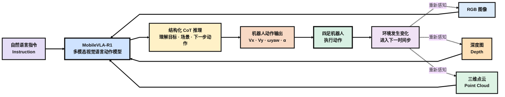


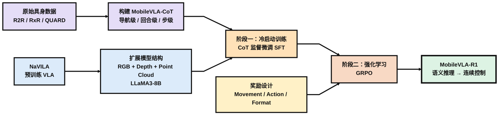

### 研究背景

MobileVLA-R1 关注的是高层语义推理与机器人底层控制之间的鸿沟。对于“绕过箱子，走到水桶旁边”这样的指令，视觉语言模型可以理解目标和空间关系，但真正控制机器狗时，还需要把这种理解进一步落实为前进速度、转向角速度和具体动作。论文认为，直接从语言和视觉预测动作容易出现语义落地不稳定的问题，而隐藏的中间表示又缺少清晰、可解释的推理过程。

受到 DeepSeek-R1 利用 CoT 与 GRPO 强化推理能力的启发，作者希望把类似的 reasoning + reinforcement learning 路线引入具身控制，让机器人不是直接从语言跳到底层动作，而是先形成显式的结构化推理，再把推理结果转化为连续控制。

为此，论文主要做了三件事：构建多粒度的 MobileVLA-CoT 数据集，在 NaVILA 基础上扩展 RGB、Depth 和 Point Cloud 多模态感知，并采用 SFT + GRPO 的两阶段训练，使模型逐步学会从语义推理落到底层控制。

### MobileVLA-CoT 数据集

MobileVLA-CoT 并不是从头采集的一套机器人数据，而是在 R2R、RxR 和 QUARD 三个已有数据集上补充 CoT 标注得到的。R2R 和 RxR 都属于 VLN 数据，核心是自然语言指令与对应的导航轨迹，其中 RxR 的指令更长，并进一步加入多语言和更细粒度的时序对齐；QUARD 则面向四足机器人控制，除了视觉和任务指令之外，还记录机器人执行过程中的状态与动作，因此能够提供连续速度、步态等更底层的控制监督。论文也正是利用前两者补充长程导航推理，利用 QUARD 补充机器人动作层面的推理。

作者使用 Gemini-2.5-Flash 对这些已有轨迹进行进一步标注。输入包括 RGB–Depth 观测、自然语言指令以及对应的 state-action history，Gemini 根据结构化 Prompt 在原有动作之前补充 `<think>...</think>` 形式的推理，并把对应的导航动作或控制信号写入 `<answer>...</answer>`，最终形成三种不同粒度的 MobileVLA-CoT。R2R 和 RxR 主要用于生成 MobileVLA-CoT-Nav，QUARD 则生成 MobileVLA-CoT-Episode 和 MobileVLA-CoT-Step；三者规模分别为 38K、18K 和 78K。原始数据集与生成数据集的关系如下所示。


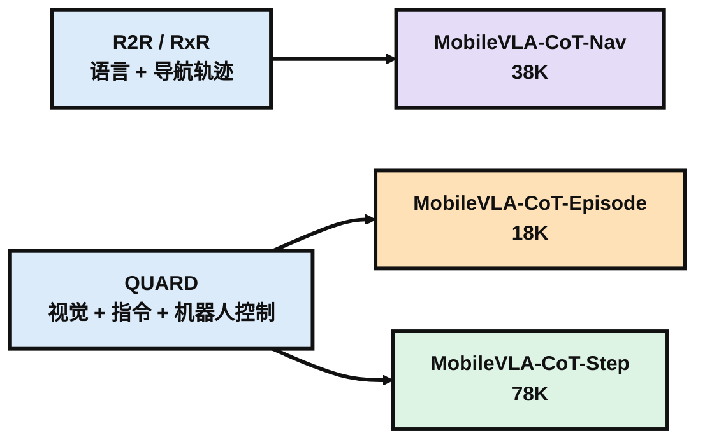

三种 CoT 的区别主要在于观察任务的尺度不同。

- Episode-CoT 面向完整的一次机器人任务，更接近对整段轨迹的宏观总结，例如机器人如何接近目标、什么时候避开障碍、之后又如何重新调整方向并完成任务，因此主要描述的是整段执行过程中的高层策略。论文给出的 Episode 示例也会依次总结 command sequence、对环境变化的响应、整体 strategy 和最终结果。
- Nav-CoT 更关注长程自然语言指令与当前导航进度之间的对应关系。例如指令是“离开卧室，进入浴室，然后停在马桶旁”，模型需要结合当前和之前看到的环境判断自己已经执行到了哪一部分：是否已经离开卧室、当前看到的门是不是浴室入口，以及接下来应该继续前进还是转向，最后给出 `move forward`、`turn left` 这类语义层面的导航动作。
- Step-CoT 则进一步靠近底层控制。它面对的是某一个具体时间步，根据当前环境和任务解释为什么机器人此时应该这样运动，并直接输出 `x_vel_cmd`、`y_vel_cmd`、`yaw_vel_cmd`、gait、step frequency 等控制参数。

整体上来说，Episode-CoT偏向于宏观规划，Nav-CoT偏向于识别当前在指令的哪一步以及当前需要做的动作用自然语言怎么表述，Step-CoT偏向于怎么把自然语言的动作转化为控制机器人做相应动作的命令序列。

### MobileVLA-R1 模型

MobileVLA-R1 的模型结构并不是从头设计，而是以 NaVILA 为初始化模型，在原有视觉语言导航能力的基础上进一步加入深度和三维点云信息。整体仍然沿用 LLaVA 风格的多模态架构：RGB、Depth 和 Point Cloud 分别经过对应的编码器提取特征，再通过 projection layer 映射到与语言模型兼容的表示空间，与自然语言指令一起送入 LLaMA3-8B。论文中 RGB 部分继承自 NaVILA，Depth 使用 DepthAnything V2，Point Cloud 则使用 Point Transformer v3。下面是整个模型的结构流程图。

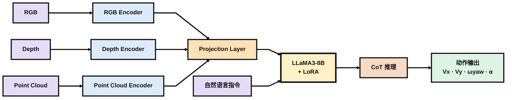

加入 Depth 和 Point Cloud 的目的，是在 RGB 语义信息之外补充更直接的空间几何信息。Depth 提供物体距离和前后层次，Point Cloud 则进一步描述三维空间结构，因此模型不仅需要判断“画面里有什么”，还能够利用距离和几何关系决定当前该向哪里运动。论文也通过后面的模态消融实验验证了 Depth 和 Point Encoder 都能继续提升导航结果。

模型最终在每个时间步接收当前的 RGB、Depth、Point Cloud 和自然语言指令，并预测机器人动作 $a_t = [V_x, V_y, \omega_{\text{yaw}}, \alpha]$。其中前三项分别表示前后、横向和转向速度，$\alpha$ 则表示离散的高层动作。与普通直接预测动作的 VLA 不同，MobileVLA-R1 希望先通过 LLaMA3-8B 形成显式的 CoT 推理，再将结果落实到具体的机器人控制上。

参数训练上，作者没有重新更新整个 8B 模型，而是采用 LoRA 进行参数高效微调，主要作用在 projection 和 LLaMA3-8B 的 attention layer，视觉编码器保持冻结。这样既保留 NaVILA 已有的视觉语言能力，又可以用较小的训练成本让模型适应新的多模态输入和 CoT 控制任务。

### SFT + GRPO 训练

MobileVLA-R1 的训练分成两个阶段。作者受到 DeepSeek-R1 的启发，希望通过强化学习进一步提升模型的推理能力，但对于同时包含视觉、语言和机器人动作的多模态模型，直接进行端到端强化学习容易出现训练不稳定。因此作者先利用前面构造的 MobileVLA-CoT 进行监督微调，让模型先学会稳定地产生结构化推理和动作，再通过 GRPO 对推理与实际控制之间的对应关系进行强化。

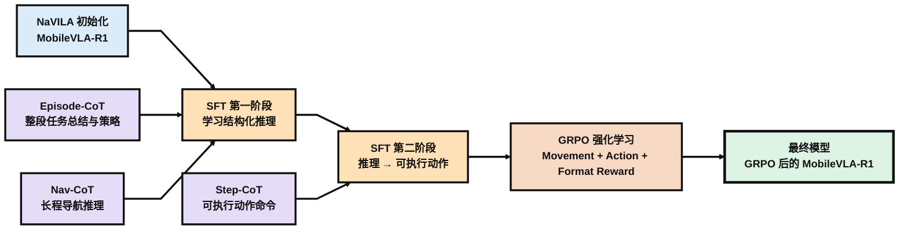

#### SFT 冷启动

SFT 又可以分成两个步骤。首先使用完整的 Episode-CoT 和 Nav-CoT 训练模型，使其学会按照 `<think>...</think><answer>...</answer>` 的格式进行推理。前者提供整个任务尺度的执行策略，后者提供长程导航过程中当前进度和下一步动作的判断，因此这一阶段主要解决的是“模型应该怎样思考和表达决策”。

随后再加入约 10K 条 Step-CoT。与前两种数据不同，Step-CoT 的 `<answer>` 中已经包含可以执行的速度和动作命令，例如前进速度、横向速度和 yaw 角速度等，这些输出可以被确定性地解析成机器人控制信号。因此第二步实际上是在前面已经建立的语义推理基础上，进一步学习如何把“应该怎么做”落到具体控制量上。

从训练方式上看，SFT 和普通语言模型监督微调没有本质区别。给定视觉、语言和一条 Gemini 生成的标准 CoT，模型按照 teacher forcing 学习标准答案中的下一个 token。也就是说，SFT 告诉模型的是：

```txt
对于这个输入，希望你尽可能复现这一条
<think> ... </think>
<answer> ... </answer>
```

这样可以很快建立稳定的输出格式和基本推理方式，但它仍然依赖 Gemini 给出的单条标准答案。如果某一种推理写法最终产生了更好的机器人动作，仅靠 SFT 本身并不会主动偏向这种结果，因此作者继续使用 GRPO 进行强化。

#### GRPO

GRPO 阶段不再为一个输入只提供一条固定的标准答案。对于同一个多模态输入 $I=(x,i)$，当前模型一次采样得到 $N$ 条不同的输出：

$$
o_1,o_2,\ldots,o_N
$$

论文训练时，每个样本生成 **8 个 response**，每个 optimization step 使用 **5 个样本**。Reward 有三个方面：

- Movement Reward比较预测速度方向和真实速度方向，使用 $V_x$、$V_y$、$V_{\text{yaw}}$ 三个连续控制量的余弦相似度：

$$
R_m=
\frac{
\mathbf{o}'^{\top}\mathbf{o}'^{*}
}{
\|\mathbf{o}'\|_2\|\mathbf{o}'^{*}\|_2
},
\qquad
\mathbf{o}'=(V_x,V_y,V_{\text{yaw}})
$$

- Action Reward 用于监督离散的高层动作。如果模型预测的动作 $a$ 与真实动作 $a^*$ 一致，则 reward 为 1，否则为 0：

$$
R_{\text{action}}
=
\begin{cases}
1, & a=a^* \\
0, & \text{otherwise}
\end{cases}
$$

- Format Reward 检查模型是否仍然保持：`<think>...</think><answer>...</answer>`这样的结构化输出格式：

$$
R_{\text{format}}
=
\begin{cases}
1, & \text{output satisfies format} \\
0, & \text{otherwise}
\end{cases}
$$

论文分别定义了三种 reward，但没有明确给出它们如何组合成最终 reward $r_i$，也没有报告三种 reward 的具体权重。下面是对三种Reward的总结归纳：

| Reward          | 约束对象                 | 希望模型学到什么         |
| --------------- | ------------------------ | ------------------------ |
| Movement Reward | $V_x,V_y,V_{\text{yaw}}$ | 运动方向与真实控制一致   |
| Action Reward   | 离散动作 $a$             | 高层动作选择正确         |
| Format Reward   | `<think><answer>`        | 保持结构化、可解析的输出 |

GRPO 的关键不只是计算 reward，而是在同一组 response 之间进行相对比较。

假设同一个输入生成的 $N$ 个 response 分别得到：

$$
r_1,r_2,\ldots,r_N
$$

论文计算第 $i$ 个 response 的 advantage：

$$
A_i
=
r_i-
\frac{1}{N}
\sum_{j=1}^{N}r_j
$$

也就是说，一个 response 是否值得强化，不只取决于自己的 reward 有多大，而取决于它是否高于同一组 response 的平均 reward。

高于平均水平的 response 得到正 advantage，在之后的 policy update 中提高出现概率；低于平均水平的 response 得到负 advantage，则降低出现概率。

随后 advantage 会进一步进行归一化：

$$
\hat{A}_i
=
\frac{A_i}{\sigma_A+\epsilon}
$$

得到 advantage 后，GRPO 最终通过下面的目标函数更新当前 policy：

$$
J_{\mathrm{GRPO}}(\theta)
=
\mathbb{E}_{j=1}^{G}
\left[
\min
\left(
\frac{\pi_\theta(o_j\mid I)}
{\pi_{\theta_{\mathrm{old}}}(o_j\mid I)}
\hat{A}_j,
\operatorname{clip}
\left(
\frac{\pi_\theta(o_j\mid I)}
{\pi_{\theta_{\mathrm{old}}}(o_j\mid I)},
1-\epsilon,
1+\epsilon
\right)
\hat{A}_j
\right)
-
\beta D_{\mathrm{KL}}
\left(
\pi_\theta\|\pi_{\mathrm{ref}}
\right)
\right]
$$

其中

$$
\frac{\pi_\theta(o_j\mid I)}
{\pi_{\theta_{\mathrm{old}}}(o_j\mid I)}
$$

表示当前 policy 相比更新前的 old policy，对第 $j$ 个 response 的生成概率发生了多大变化。前面的 $\hat{A}_j$ 决定了更新方向：如果 $\hat{A}_j>0$，说明这个 response 的 reward 高于组内平均水平，就希望提高它之后再次被生成的概率；如果 $\hat{A}_j<0$，则降低它的生成概率。

如果只按照 advantage 更新，模型可能会因为某个 response 的 reward 较高而一次性大幅提高它的概率，因此 GRPO 沿用了 PPO 中的 clipping 机制，将概率比值限制在 $1-\epsilon$ 到 $1+\epsilon$ 附近，并通过 `min` 选择更加保守的目标，从而限制单次 policy update 的幅度。

因此前半部分可以简单理解为：

$$
\text{Reward}
\rightarrow
\text{组内 Advantage}
\rightarrow
\text{调整 Response 的生成概率}
\rightarrow
\text{Clipping 限制更新幅度}
$$

目标函数最后还有一项：

$$
-\beta D_{\mathrm{KL}}
\left(
\pi_\theta\|\pi_{\mathrm{ref}}
\right)
$$

其中 $\pi_{\mathrm{ref}}$ 是冻结的 reference model，也就是经过 SFT 后得到的模型。KL divergence 用来限制当前 policy 与 reference policy 之间的距离，避免模型为了追求 reward 而快速偏离已经通过 SFT 学到的语言、CoT 格式和基本动作能力。

这样一来，GRPO 的完整过程就是先让当前模型针对同一个输入生成多个 response，根据 Movement、Action 和 Format 三种 reward 对这些 response 进行评价，再通过组内比较得到 advantage，最后利用 $J_{\mathrm{GRPO}}$ 提高较好 response 的生成概率、降低较差 response 的生成概率，同时通过 clipping 和 KL regularization 控制更新幅度。GRPO的流程大致如下所示。

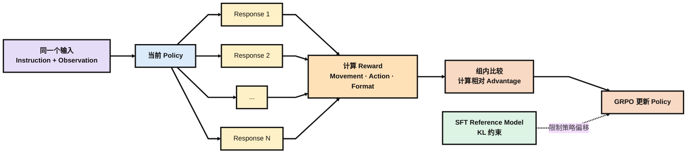

### 实验

前面的 MobileVLA-CoT 都只由 R2R、RxR 和 QUARD 的训练数据生成，因此实验主要检验经过这些数据训练后的模型能否泛化到未参与 CoT 构造的环境和任务。高层导航部分在 R2R-CE 和 RxR-CE 的 Val-Unseen split 上测试，评估模型在未见场景中根据长程自然语言指令完成导航的能力；底层控制部分按照 QUARD 的官方协议，在六类四足机器人任务上评估动作执行能力。除此之外，作者还将模型部署到 Unitree Go2，在 Workspace、Corridor 和 Outdoor 三种真实环境中进行测试。在这些实验的基础上，作者通过消融实验验证了三种Reward设计的必要性。

**VLN-CE**

在 R2R-CE 和 RxR-CE 上，论文使用 NE、OS、SR、SPL 和 nDTW 等标准导航指标。NE 表示最终位置与目标之间的距离；OS 表示整条轨迹中是否曾到达过目标附近，而 SR 要求机器人最终真正停在目标附近；SPL 在成功率基础上进一步考虑路径效率；nDTW 则衡量实际导航轨迹与参考轨迹整体的相似程度。

| 方法             | R2R-CE SR↑ | R2R-CE SPL↑ | RxR-CE SR↑ | RxR-CE SPL↑ | RxR-CE nDTW↑ |
| ---------------- | ---------: | ----------: | ---------: | ----------: | -----------: |
| NaVILA           |       54.0 |        49.0 |       49.3 |        44.0 |         58.8 |
| StreamVLN        |       56.9 |        51.9 |       52.9 |        46.0 |         61.9 |
| CorrectNav       |       65.1 |        62.3 |       69.3 |        63.3 |         75.2 |
| **MobileVLA-R1** |   **68.3** |    **65.2** |   **71.5** |    **66.8** |     **76.1** |

MobileVLA-R1 在两个数据集上都取得了最高的 SR 和 SPL。相比初始化模型 NaVILA，R2R-CE 的 SR 从 54.0 提升到 68.3，RxR-CE 则从 49.3 提升到 71.5；即使与更强的 CorrectNav 相比，也分别提升了 3.2 和 2.2 个百分点。论文特别指出，这里的 MobileVLA-R1 没有使用 simulator 预训练的 waypoint predictor，而部分传统 VLN 方法依赖这一额外模块，因此作者主要强调的是在不依赖 waypoint predictor 的方法中取得更好的结果。

**QUARD**

论文在 Distinguish、Go to、Go avoid、Go through、Crawl 和 Unload 六类任务上进行评测，每项结果都是 25 个 evaluation episodes 的成功率。

| 方法             | Distinguish |    Go to | Go avoid | Go through |    Crawl |   Unload |  Average |
| ---------------- | ----------: | -------: | -------: | ---------: | -------: | -------: | -------: |
| CLIP             |        0.44 |     0.43 |     0.45 |       0.19 |     0.00 |     0.00 |     0.25 |
| VC-1             |        0.46 |     0.43 |     0.45 |       0.31 |     0.00 |     0.00 |     0.28 |
| QUART            |        0.66 |     0.60 |     0.53 |       0.41 |     0.32 |     0.12 |     0.44 |
| MoRE             |        0.82 |     0.80 |     0.59 |       0.57 |     0.49 |     0.33 |     0.60 |
| **MobileVLA-R1** |    **0.92** | **0.89** | **0.71** |   **0.65** | **0.58** | **0.44** | **0.73** |

MobileVLA-R1 在六类任务上都取得了最高成功率，平均成功率达到 0.73，相比 MoRE 的 0.60 有比较明显的提升。Easy 的 Distinguish 和 Go to 已经接近 0.9，而 Crawl、Unload 这类需要更复杂身体动作的任务仍然明显更难，但 MobileVLA-R1 在这些任务上也保持了优势。

**真机实验**

真机实验使用 Unitree Go2，搭载 L2 LiDAR、Intel RealSense D435i RGB-D 相机和 Jetson Orin Nano。模型接收 RGB、Depth 和 3D Point Cloud，在 Workspace、Corridor 和 Outdoor 三种环境中执行 Simple 和 Complex 两类自然语言指令。算力不足时，机器人会把感知数据发送到远程 H20，由 MobileVLA-R1 完成推理后再将速度和动作命令发送回机器人执行。

| 方法             | Workspace Simple SR↑ | Workspace Complex SR↑ | Corridor Simple SR↑ | Corridor Complex SR↑ | Outdoor Simple SR↑ | Outdoor Complex SR↑ |
| ---------------- | -------------------: | --------------------: | ------------------: | -------------------: | -----------------: | ------------------: |
| GPT-4o           |                 0.67 |                  0.33 |                0.53 |                 0.00 |               0.67 |                0.50 |
| NaVILA           |                 0.83 |                  0.80 |                0.89 |                 0.67 |               0.91 |                0.83 |
| **MobileVLA-R1** |             **0.93** |              **0.91** |            **1.00** |             **0.86** |           **1.00** |            **0.96** |

MobileVLA-R1 在三类环境和两种指令难度下都高于 GPT-4o 和 NaVILA。相比简单指令，更值得注意的是 Complex setting：Workspace、Corridor 和 Outdoor 的成功率分别达到 0.91、0.86 和 0.96，说明最终模型在包含多步推理和长程空间规划的指令下，也能够迁移到论文设置中的真实机器人环境。

**Reward 消融**

论文进一步在 R2R-CE Val-Unseen 上分别移除 Movement、Action 和 Format Reward，验证 GRPO 中三种奖励的作用。

| $R_m$ | $R_{\text{action}}$ | $R_{\text{format}}$ |      SR↑ |     SPL↑ |
| :---: | :-----------------: | :-----------------: | -------: | -------: |
|   ✗   |          ✗          |          ✗          |     58.0 |     53.2 |
|   ✓   |          ✗          |          ✗          |     60.7 |     55.5 |
|   ✗   |          ✓          |          ✗          |     61.9 |     56.8 |
|   ✗   |          ✗          |          ✓          |     59.6 |     54.7 |
|   ✓   |          ✓          |          ✗          |     64.5 |     60.2 |
|   ✓   |          ✗          |          ✓          |     63.4 |     59.1 |
|   ✗   |          ✓          |          ✓          |     65.2 |     61.0 |
|   ✓   |          ✓          |          ✓          | **68.3** | **65.2** |

不使用 GRPO reward、只保留 SFT 时，SR 为 58.0；加入完整的三种 reward 后提升到 68.3。单独来看 Action Reward 的提升最大，说明高层动作是否正确对导航结果影响比较直接；三种 reward 两两组合后效果都会继续提升，而完整组合取得最好结果，说明运动方向、离散动作和输出格式在训练中起到了互补作用。

## FSR-VLN: 融合几何与图像两条路线的快慢推理

论文链接：

[FSR-VLN: Fast and Slow Reasoning for Vision-Language Navigation with Hierarchical Multi-modal Scene Graph](https://arxiv.org/abs/2509.13733)

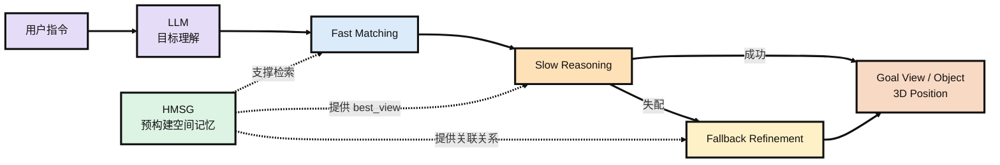


### 研究背景

FSR-VLN 研究的是在离线场景图已经构建完成的条件下，如何根据用户指令找到目标物体。系统的输入是一条文本或语音指令，输出则是目标物体对应的视图节点以及它在场景中的三维坐标。也就是说，这篇论文主要关注的是建图完成之后的目标理解、检索和定位，而不是在线探索或实时建图。

现有方法大致可以分成两条路线。一类是 OK-Robot、HOVSG 这样的几何语义地图或 3D 场景图，把 CLIP、OWL-ViT 等视觉模型的特征存到体素或物体节点中，检索时直接计算指令文本和节点特征之间的相似度。这类方法有明确的三维几何表示，目标一旦匹配到物体节点，就比较容易得到空间位置，但对目标的理解主要依赖 embedding 匹配。另一类方法则把环境表示成由历史图像组成的拓扑图，再直接利用 VLM 或长上下文模型在图像序列中寻找目标，语义推理能力更强，但缺少显式的物体级三维几何表示。FSR-VLN 想做的就是把这两种表示结合起来：既保留场景图中的几何和物体信息，也保留原始图像供 VLM 做进一步判断，因此在原有的 Floor–Room–Object 结构中加入了 View 节点，形成后面的 HMSG。两条路线和本文脉络如下所示。

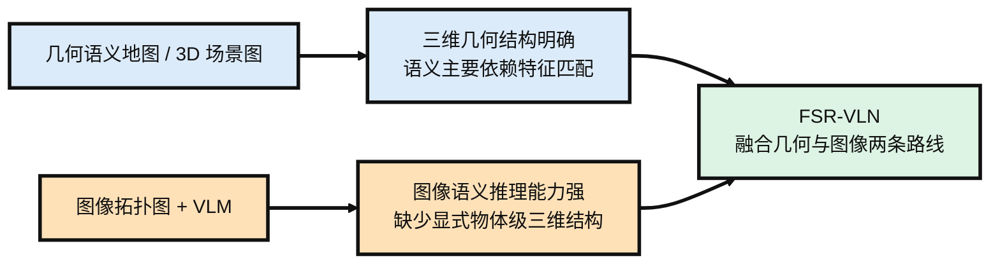

### HMSG

FSR-VLN 使用的是 Hierarchical Multi-modal Scene Graph（HMSG）。它并不是从头设计一种新的地图表示，而是在 HOVSG 原有的 Floor–Room–Object 三层场景图中加入了一层 View，用 View 把原始图像和三维物体连接起来。整体关系可以理解为 Floor 下面包含 Room，每个 Room 下面同时包含 View 和 Object；View 与它能够观测到的 Object 之间建立可见关系，不同 View 之间则根据相对位姿建立拓扑连接。这样一来，Floor 和 Room 仍然负责组织空间层级，Object 保留具体物体的三维包围盒、点云和语义特征，而 View 则保留机器人历史观测到的图像、相机位姿、CLIP 特征以及 VLM 生成的文字描述。

HMSG 的底层建图基本沿用了 HOVSG。机器人先通过 RGBD 相机和 LiDAR 采集数据，由 FAST-LIVO2 得到带位姿的点云和图像，再依次完成楼层划分、房间边界划分和物体实例聚类，得到原来的 Floor–Room–Object 场景图。这部分并不是 FSR-VLN 的主要创新，论文真正新增的是如何把历史图像作为 View 节点接入这套结构。具体来说，每个 View 根据相机位姿和房间边界确定所属 Room，同时由 VLM 为图像生成一段文字描述。

在 View 接入之后，系统还会为每个 Object 找到所有能够看到它的 View，并计算物体在这些视图中的平均深度，选择平均深度最小的那个作为该物体的 best_view。这个 best_view 后面很重要，因为在线推理时 Slow Reasoning 会直接用它对应的原始图像来核实 CLIP 找到的物体是否正确。除此之外，HOVSG 中的房间名称原本是直接给定的，而 FSR-VLN 改成让 GPT-4o 根据房间内 View 对应的图像内容推断房间名称。下面是在HOVSG基础上建立HMSG的流程图。

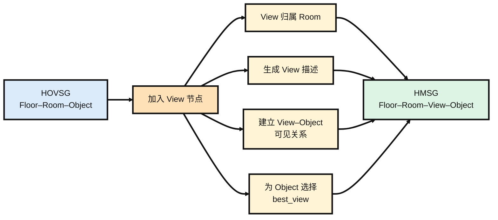


HMSG 的拓扑关系可以概括为 `Floor → Room → {View, Object}`。Floor 与 Room、Room 与 View/Object 之间是层级包含关系，用来组织场景中的空间层次；View 与 Object 之间建立可见关系，表示某个物体可以从哪些历史视角中被观测到；不同 View 之间则根据相对位姿建立无向拓扑边，用来描述机器人在各个历史观测位置之间的空间连接。这样，原本独立的三维物体节点和原始图像视角就通过 View–Object 的关系连接起来。下面是HMSG的各种节点的拓扑关系。


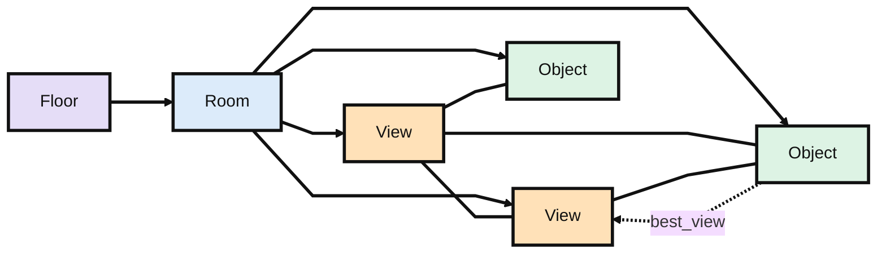


### 在线推理

在线推理首先由 LLM 对用户指令进行理解。对于“带我去办公室的蓝色圆柱凳”这类显式指令，LLM 会解析出房间和物体；对于“我累了，哪里能休息”这类隐式指令，则先推断用户真正需要寻找的目标物体。如果指令中包含房间信息，系统会先完成 Room 匹配，将后续搜索限制在对应房间内。在此基础上，View 和 Object 两层同时进行 CLIP 相似度匹配：Object 层得到一个候选目标物体，View 层则得到一个候选目标视图。这个阶段基本依赖 embedding 相似度，因此速度很快，但匹配结果不一定可靠。

接下来是 Slow Reasoning。系统取出候选 Object 在建图阶段已经保存好的 `best_view`，把对应原始图像交给 GPT-4o，判断指令描述的目标是否真的出现在图中。如果确认存在，就直接接受 Fast Matching 的结果；如果判断不可靠，则进行一次视图回退。系统先从其他 View 中筛出一个与目标语义最相关的候选视图，再将它与 Fast Matching 阶段得到的候选 View 进行视觉比较，确定最终目标视图。最后只在这个 View 所关联的 Object 中重新计算 CLIP 相似度，更新目标物体。目标确定之后，三维位置直接取自 Object 节点中已经保存的几何信息，交给后续导航与控制模块。整个回退只执行一次，论文没有设计循环验证或多轮重试。下面是整体的推理流程。

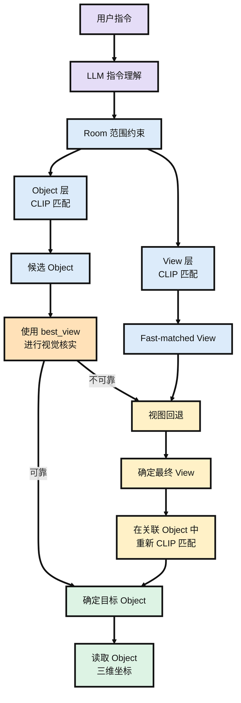

### 实验

实验同时在自采真实环境和 HM3D-SEM 公开数据集上进行。真实环境使用 Unitree-G1 搭载 Intel RealSense D455 RGBD 相机和 Mid360 LiDAR，在包含长走廊和多个房间的办公场景中采集数据，并划分为 Room1–Room4 四组评测集；另外还在 HM3D-SEM 的 8 个场景上测试泛化能力。

**实验设置**

| 项目              | 设置                                                         |
| ----------------- | ------------------------------------------------------------ |
| 真实环境          | Unitree-G1 + RealSense D455 + Mid360 LiDAR，Room1–Room4      |
| 公开数据集        | HM3D-SEM，8 个场景                                           |
| 指令              | 87 条众包指令                                                |
| 指令类型          | RF（显式目标）、RR（需要目标推断）、SO（小物体）、ST（依赖房间级空间信息） |
| 指标              | SR、$RSR_{top-n@k}$，其中 $n\in\{1,5\}$，$k\in\{1,2,3,4,5\}$ |
| 自采数据 Baseline | OK-Robot、HOVSG、MobilityVLA                                 |
| HM3D-SEM Baseline | HOVSG、osmAG-LLM                                             |

其中 $RSR_{top-n@k}$ 表示 top-n 预测中至少有一个结果落在真值 $k$ 米范围内的查询比例。当 $n=1,\ k=1$ 时，RSR 与 SR 等价。

**自采数据集主实验**

| 方法        |        SR |    成功数 | 方法特点                   |
| ----------- | --------: | --------: | -------------------------- |
| MobilityVLA |     34.5% |     30/87 | 图像拓扑图 + VLM           |
| HOVSG       |     51.7% |     45/87 | 3D 场景图 + CLIP           |
| OK-Robot    |     60.9% |     53/87 | 3D voxel map               |
| **FSR-VLN** | **92.0%** | **80/87** | HMSG + Fast/Slow Reasoning |

FSR-VLN 的平均 SR 达到 **92%（80/87）**，明显高于其他三种方法；在 RSR@Top1 中，距离阈值扩大到 4–5 m 时进一步达到 **96.6%（84/87）**。

这里有一个比较重要的实验协议差异。OK-Robot、MobilityVLA 和 HOVSG 缺少完整的房间级信息，因此在 ST 指令下只比较 LLM 解析出的物体查询，同类物体只要出现在任意房间就可以算成功；而 FSR-VLN 要求目标物体位于指定房间，并且 View 和 Object 都匹配正确才算成功。因此 FSR-VLN 实际是在更严格的评价标准下取得了上述结果。

MobilityVLA 的现象也比较有意思：它在 1–2 m 范围内的 RSR@Top1 最低，但距离容差扩大到 3–5 m 后会上升到第二。这说明它利用图像序列和 VLM 做语义推理的能力并不弱，主要问题还是缺少足够精确的三维空间定位。FSR-VLN 则通过 HMSG 同时保留物体级三维结构和原始图像，再通过 Fast Matching 和 Slow Reasoning 将两者结合起来。

**消融实验**

|  ST  | NR / Slow Reasoning |    RSR@1m | 说明                      |
| :--: | :-----------------: | --------: | ------------------------- |
|  ✗   |          ✗          |     0.724 | 基础检索                  |
|  ✓   |          ✗          |     0.816 | 加入房间级空间约束        |
|  ✓   |          ✓          | **0.920** | 再加入 VLM 核实与失配修正 |

只使用基础检索时，RSR@1m 为 **0.724**；加入 Spatial Target 信息后提升到 **0.816**，说明房间级约束可以把物体搜索限制在目标房间内，减少不同房间中同类物体造成的误匹配。

进一步加入 Navigation Reasoning，也就是前面的 Slow Reasoning 后，RSR@1m 提升到 **0.920**，5 m 阈值下达到 **0.966**。可以理解为 ST 主要解决“应该在哪个房间找”，Slow Reasoning 则进一步解决“Fast Matching 找到的目标到底对不对”。代价是额外的 VLM 推理开销，响应时间也从 **1.5 s 增加到 5.5 s**。

**HM3D-SEM**

在 HM3D-SEM 的 8 个场景上也能观察到类似趋势。osmAG-LLM 虽然同样使用层级化语义地图，但主要保留 XML 级的文本信息，因此 Top-1 检索成功率低于保留开放词汇视觉特征的 HOVSG。FSR-VLN 在 CLIP visual embedding 的基础上又进一步保留原始图像，并通过 VLM 与图像交互，因此检索效果继续提升，说明这种几何与图像结合的方式并不只适用于自采环境。

