八月初启，暑色未收，秋意已在风里。许多新的问题也像尚未翻开的书页一样，安静地等在前面。此刻并不急着知道它们最终会通向哪里，只愿在一次次阅读、推演与尝试之间，渐渐看清一些东西，也渐渐发现更多值得追问的方向。山长水阔，且从这一卷开始。

<!-- more -->

## NaVILA：从语言化导航决策到腿式控制的双层架构

论文链接：

[NaVILA: Legged Robot Vision-Language-Action Model for Navigation](https://arxiv.org/abs/2412.04453)

### 研究背景

视觉语言模型已经具备较强的场景理解和语言推理能力，但将这种能力直接用于腿式机器人仍然存在一个问题：高层导航关注目标、空间关系和长程决策，而机器人实际执行需要高频处理关节控制、动力学、地形和障碍，并且底层动作还与具体机器人本体强相关。直接从视觉和语言预测关节动作，不仅需要跨越语义推理与低层控制之间的表示差异，也使模型训练依赖大量机器人特定的控制数据。

NaVILA 因此采用双层架构。High-level VLA 根据自然语言指令和视觉观测进行导航推理，输出 `Move forward 75 cm`、`Turn right 30 degrees` 等带有空间信息的中层语言动作；Low-level Locomotion Policy 再将其转化为具体机器人的运动控制。这样既可以让高层模型利用仿真 VLN、人类视频以及通用视觉语言数据等更广泛的数据来源，也使中层动作摆脱具体机器人关节空间的限制，从而让同一个 High-level VLA 能够复用于不同机器人，而只需针对不同本体训练对应的低层控制策略。下图展现了论文提出的双层架构。

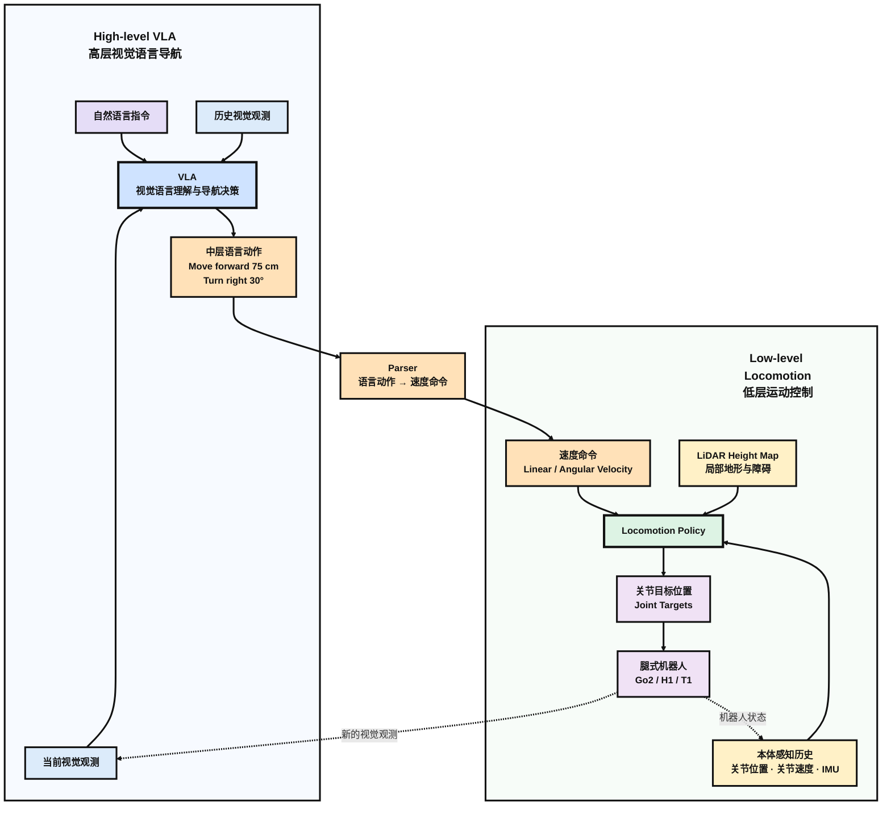


### High-level VLA

NaVILA 的 High-level VLA 根据历史观测、当前视图和语言指令生成中层导航动作，而不直接预测低层关节控制。该模块以 VILA 为 backbone，并通过导航专用 prompt 和多源 SFT 数据进行适配。下面展示的是第一层模型的训练和推理流程。

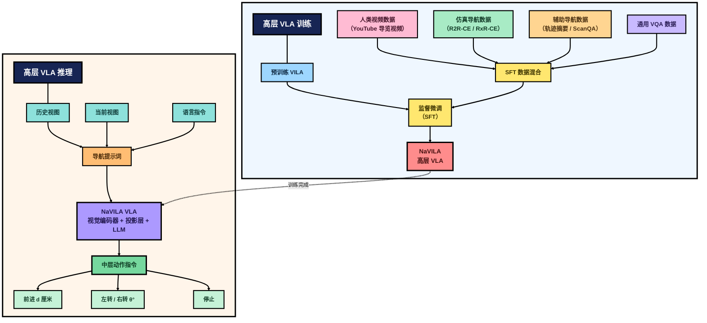

#### VILA

NaVILA 的 High-level VLA 建立在 VILA 之上。VILA 是一个 image-based Vision-Language Model，主要由 Vision Encoder、Projector 和 LLM 三部分组成：图像首先被编码为 visual tokens，经降采样和 Projector 映射到语言空间，再与文本 token 一同输入 LLM 进行自回归生成。VILA 具有较强的 multi-image reasoning 能力，因此适合处理 VLN 中连续视觉观测之间的关系。

对于视频输入，VILA 并不使用专门的 video encoder，而是将视频均匀采样为多帧图像后共同输入模型。但这种方式没有区分历史观测与当前观测的不同作用，因此 NaVILA 在此基础上进一步设计了 Navigation Prompt。

#### Navigation Prompt

原始 VILA 对视频帧进行均匀采样，但没有区分不同时间帧在导航中的作用。NaVILA 将视觉观测划分为 History Views 和 Current View：当前帧用于判断机器人此刻的动作，而历史帧作为记忆信息，帮助模型追踪已经经过的位置和任务进度。具体地，模型始终保留最新帧作为当前观测，并从此前的历史帧中均匀采样，同时确保第一帧被保留。

为了让 LLM 显式区分二者，NaVILA 在 prompt 中使用 `"a video of historical observations:"` 和 `"current observation:"` 等文本提示，而没有额外引入特殊 token。随后将历史观测、当前观测与导航指令组合成完整的 Navigation Prompt，引导模型输出带有距离或角度信息的中层动作，如 forward d cm、turn left $\theta^\circ$ 或 stop。

#### Human Video

NaVILA 利用真实人类视频扩展连续导航训练数据。以约 2K 个 YouTube 第一视角 touring videos 为基础，作者首先通过 entropy-based sampling 提取约 20K 条具有代表性的 trajectories，再使用 MASt3R 估计 metric camera pose，从人的相机运动中恢复对应的 step-wise navigation actions。这使原本没有机器人动作标签的人类视频能够被转换为连续导航监督。

与此同时，作者利用 VILA 进行 trajectory captioning，再由 GPT-4o rephrase，为每条 trajectory 生成对应的自然语言导航指令。最终，人类视频被转换为可用于 VLA 训练的 trajectory–instruction–action 数据，其中 action 采用距离和角度等中层空间表示，而不是机器人特定的关节动作。

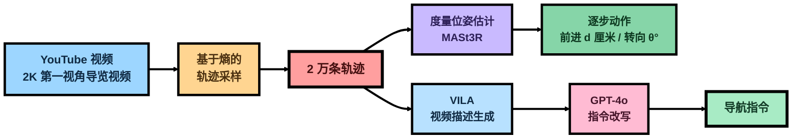

#### Blend Dataset

仅依赖导航动作数据对 VLM 进行微调，容易使模型过度拟合特定的动作模式，同时削弱预训练 VLM 原有的视觉理解与通用知识。为了在学习导航能力的同时保持模型的泛化能力，NaVILA 构建了一个多来源的 SFT Dataset Blend。训练数据主要从四个方面组成：真实视频导航数据、仿真导航数据、辅助导航数据以及通用 VQA 数据。

|       数据类型       |                 主要数据                  |                           主要作用                           |
| :------------------: | :---------------------------------------: | :----------------------------------------------------------: |
|   Real Navigation    |           Human Touring Videos            |    引入真实世界视觉与人类运动轨迹，提高 sim-to-real 泛化     |
| Simulated Navigation |              R2R-CE、RxR-CE               | 提供标准 VLN 的 step-wise action supervision，学习核心导航行为 |
| Auxiliary Navigation | EnvDrop、Trajectory Summarization、ScanQA |            增强指令多样性、轨迹理解与空间场景理解            |
|     General VQA      |  LLaVA-1.5、ShareGPT4V、Video-ChatGPT 等  |            保留预训练 VLM 的通用视觉语言理解能力             |

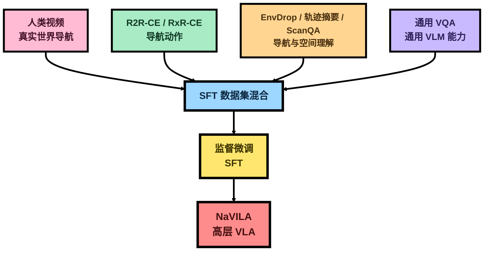

#### SFT

NaVILA 从已经完成视觉语言语料预训练的 VILA stage-2 model 开始训练，并使用前述多来源 SFT Dataset Blend 对模型进行监督微调。对于 navigation-specific data，历史帧与当前帧按照前述采样策略组织，并与 Navigation Prompt 一同构成模型输入，使模型学习生成带有距离或角度信息的中层导航动作。

训练时，Vision Encoder、Connector 和 LLM 均保持可训练状态，整个 VLM 共同进行参数更新，并在混合数据集上训练一个 epoch。通过这一过程，原本面向通用视觉语言任务的 VILA 被进一步适配为能够根据视觉历史、当前观测和语言指令生成导航动作的 NaVILA High-level VLA。

### Low-level Locomotion

NaVILA 的 High-level VLA 只负责生成带有空间信息的中层导航动作，并不直接控制机器人关节。Low-level Locomotion 首先将这些语言动作转换为 velocity commands，再由 visual locomotion policy 结合 proprioception 和 LiDAR-based height map 实时生成机器人关节目标位置。该策略通过 single-stage PPO 在仿真环境中训练，使机器人能够在跟踪高层运动指令的同时完成局部避障和稳定运动。下图展示了第二层模型的训练和推理过程。

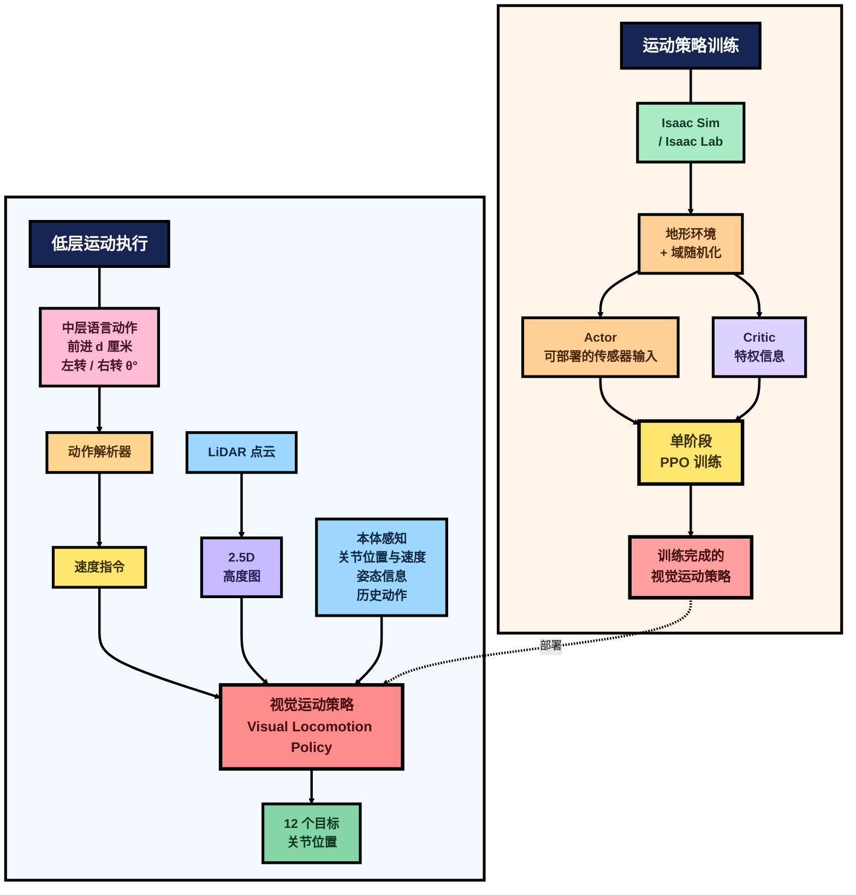

#### Policy

High-level VLA 输出的中层动作仍然是自然语言形式，例如 `Move forward 75 cm` 或 `Turn right 30 degrees`，因此不能直接作为 locomotion policy 的输入。NaVILA 首先使用 regular-expression parser 从语言动作中提取动作类型及其空间参数，再将其转换为低层策略可以跟踪的 velocity command。

具体而言，`forward`、`left`、`right` 和 `stop` 分别对应固定的线速度或角速度：$v_{\text{forward}}=0.5\,\mathrm{m/s}$、$\omega_{\text{left}}=\frac{\pi}{6}\,\mathrm{rad/s}$、$\omega_{\text{right}}=-\frac{\pi}{6}\,\mathrm{rad/s}$，以及 $v_{\text{stop}}=0$。

VLA 输出的距离或旋转角度用于确定该速度命令的持续时间。例如，对于 `Move forward 75 cm`，Parser 提取出 `forward` 和 `75 cm`，并将其转换为 $v_x=0.5\,\mathrm{m/s}$，持续时间为 $T=\frac{0.75}{0.5}=1.5\,\mathrm{s}$。

因此，高层 VLA 决定机器人朝什么方向运动以及运动多远，而 Low-level Locomotion Policy 不再处理语言语义，而是在每个控制 timestep 中根据给定的 velocity command 和机器人当前状态生成关节控制，即 $\pi(o_t,v_t^{\mathrm{cmd}})\rightarrow q_t^d$，其中 $q_t^d\in\mathbb{R}^{12}$ 表示 Unitree Go2 十二个关节的目标位置。

#### 局部避障

NaVILA 使用 LiDAR 获取机器人周围的几何信息，并将点云转换为 2.5D Height Map 输入 Low-level Locomotion Policy。Policy 在跟踪 VLA 所给 velocity command 的同时，根据局部地形信息实时调整运动，从而处理障碍物与复杂地形。相比高层 VLA 的低频导航决策，Low-level Policy 高频运行，负责实时 locomotion 与 obstacle avoidance。

#### 强化学习

NaVILA 的 Low-level Locomotion Policy 在 Isaac Sim 中使用 PPO 进行强化学习训练。不同于 teacher-student distillation，作者采用 single-stage RL training，直接训练最终用于部署的 Policy。

训练采用 asymmetric Actor-Critic。Actor 只使用真实部署时可获得的信息，包括 velocity command、proprioception history 和 LiDAR Height Map，并输出 12 个关节目标位置 $q_t^d\in\mathbb{R}^{12}$。Critic 仅在训练阶段使用，可以额外访问仿真中的 privileged information，以更准确地估计 value function 并辅助 PPO 更新。训练完成后只保留 Actor。

Reward 主要约束 velocity tracking、身体稳定性、运动平滑性和能耗等 locomotion objectives。同时，Policy 在多种地形中训练，并对质量、摩擦、motor strength、system delay 等进行 domain randomization，增强 sim-to-real 鲁棒性。

## MobileVLA-R1：缝合语义推理与底层控制之间的鸿沟
论文链接：

[MobileVLA-R1: Reinforcing Vision-Language-Action for Mobile Robots](https://arxiv.org/abs/2511.17889)

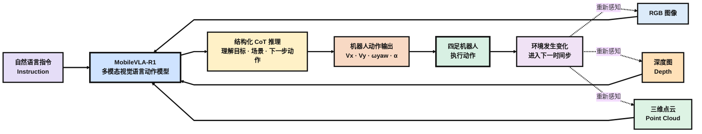


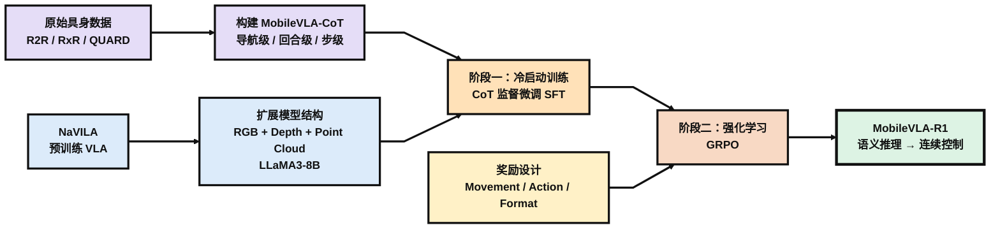

### 研究背景

MobileVLA-R1 关注的是高层语义推理与机器人底层控制之间的鸿沟。对于“绕过箱子，走到水桶旁边”这样的指令，视觉语言模型可以理解目标和空间关系，但真正控制机器狗时，还需要把这种理解进一步落实为前进速度、转向角速度和具体动作。论文认为，直接从语言和视觉预测动作容易出现语义落地不稳定的问题，而隐藏的中间表示又缺少清晰、可解释的推理过程。

受到 DeepSeek-R1 利用 CoT 与 GRPO 强化推理能力的启发，作者希望把类似的 reasoning + reinforcement learning 路线引入具身控制，让机器人不是直接从语言跳到底层动作，而是先形成显式的结构化推理，再把推理结果转化为连续控制。

为此，论文主要做了三件事：构建多粒度的 MobileVLA-CoT 数据集，在 NaVILA 基础上扩展 RGB、Depth 和 Point Cloud 多模态感知，并采用 SFT + GRPO 的两阶段训练，使模型逐步学会从语义推理落到底层控制。

### MobileVLA-CoT 数据集

MobileVLA-CoT 并不是从头采集的一套机器人数据，而是在 R2R、RxR 和 QUARD 三个已有数据集上补充 CoT 标注得到的。R2R 和 RxR 都属于 VLN 数据，核心是自然语言指令与对应的导航轨迹，其中 RxR 的指令更长，并进一步加入多语言和更细粒度的时序对齐；QUARD 则面向四足机器人控制，除了视觉和任务指令之外，还记录机器人执行过程中的状态与动作，因此能够提供连续速度、步态等更底层的控制监督。论文也正是利用前两者补充长程导航推理，利用 QUARD 补充机器人动作层面的推理。

作者使用 Gemini-2.5-Flash 对这些已有轨迹进行进一步标注。输入包括 RGB–Depth 观测、自然语言指令以及对应的 state-action history，Gemini 根据结构化 Prompt 在原有动作之前补充 `<think>...</think>` 形式的推理，并把对应的导航动作或控制信号写入 `<answer>...</answer>`，最终形成三种不同粒度的 MobileVLA-CoT。R2R 和 RxR 主要用于生成 MobileVLA-CoT-Nav，QUARD 则生成 MobileVLA-CoT-Episode 和 MobileVLA-CoT-Step；三者规模分别为 38K、18K 和 78K。原始数据集与生成数据集的关系如下所示。


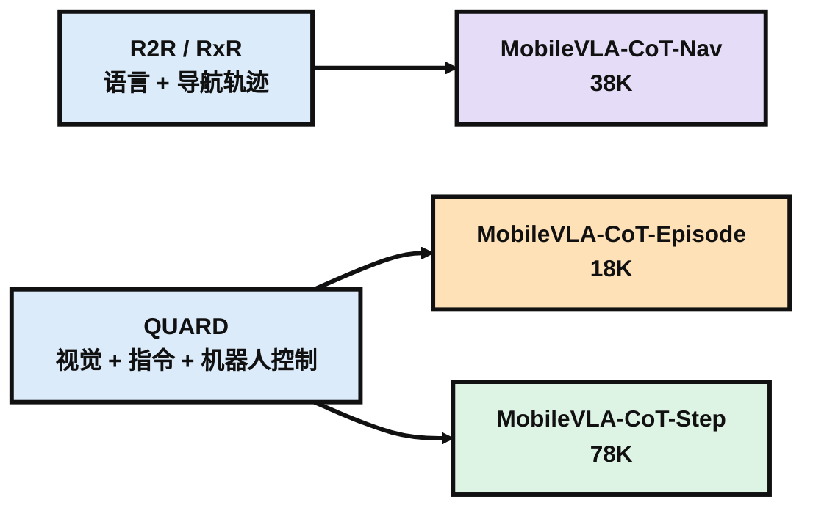

三种 CoT 的区别主要在于观察任务的尺度不同。

- Episode-CoT 面向完整的一次机器人任务，更接近对整段轨迹的宏观总结，例如机器人如何接近目标、什么时候避开障碍、之后又如何重新调整方向并完成任务，因此主要描述的是整段执行过程中的高层策略。论文给出的 Episode 示例也会依次总结 command sequence、对环境变化的响应、整体 strategy 和最终结果。
- Nav-CoT 更关注长程自然语言指令与当前导航进度之间的对应关系。例如指令是“离开卧室，进入浴室，然后停在马桶旁”，模型需要结合当前和之前看到的环境判断自己已经执行到了哪一部分：是否已经离开卧室、当前看到的门是不是浴室入口，以及接下来应该继续前进还是转向，最后给出 `move forward`、`turn left` 这类语义层面的导航动作。
- Step-CoT 则进一步靠近底层控制。它面对的是某一个具体时间步，根据当前环境和任务解释为什么机器人此时应该这样运动，并直接输出 `x_vel_cmd`、`y_vel_cmd`、`yaw_vel_cmd`、gait、step frequency 等控制参数。

整体上来说，Episode-CoT偏向于宏观规划，Nav-CoT偏向于识别当前在指令的哪一步以及当前需要做的动作用自然语言怎么表述，Step-CoT偏向于怎么把自然语言的动作转化为控制机器人做相应动作的命令序列。

### MobileVLA-R1 模型

MobileVLA-R1 的模型结构并不是从头设计，而是以 NaVILA 为初始化模型，在原有视觉语言导航能力的基础上进一步加入深度和三维点云信息。整体仍然沿用 LLaVA 风格的多模态架构：RGB、Depth 和 Point Cloud 分别经过对应的编码器提取特征，再通过 projection layer 映射到与语言模型兼容的表示空间，与自然语言指令一起送入 LLaMA3-8B。论文中 RGB 部分继承自 NaVILA，Depth 使用 DepthAnything V2，Point Cloud 则使用 Point Transformer v3。下面是整个模型的结构流程图。

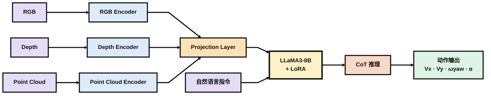

加入 Depth 和 Point Cloud 的目的，是在 RGB 语义信息之外补充更直接的空间几何信息。Depth 提供物体距离和前后层次，Point Cloud 则进一步描述三维空间结构，因此模型不仅需要判断“画面里有什么”，还能够利用距离和几何关系决定当前该向哪里运动。论文也通过后面的模态消融实验验证了 Depth 和 Point Encoder 都能继续提升导航结果。

模型最终在每个时间步接收当前的 RGB、Depth、Point Cloud 和自然语言指令，并预测机器人动作 $a_t = [V_x, V_y, \omega_{\text{yaw}}, \alpha]$。其中前三项分别表示前后、横向和转向速度，$\alpha$ 则表示离散的高层动作。与普通直接预测动作的 VLA 不同，MobileVLA-R1 希望先通过 LLaMA3-8B 形成显式的 CoT 推理，再将结果落实到具体的机器人控制上。

参数训练上，作者没有重新更新整个 8B 模型，而是采用 LoRA 进行参数高效微调，主要作用在 projection 和 LLaMA3-8B 的 attention layer，视觉编码器保持冻结。这样既保留 NaVILA 已有的视觉语言能力，又可以用较小的训练成本让模型适应新的多模态输入和 CoT 控制任务。

### SFT + GRPO 训练

MobileVLA-R1 的训练分成两个阶段。作者受到 DeepSeek-R1 的启发，希望通过强化学习进一步提升模型的推理能力，但对于同时包含视觉、语言和机器人动作的多模态模型，直接进行端到端强化学习容易出现训练不稳定。因此作者先利用前面构造的 MobileVLA-CoT 进行监督微调，让模型先学会稳定地产生结构化推理和动作，再通过 GRPO 对推理与实际控制之间的对应关系进行强化。

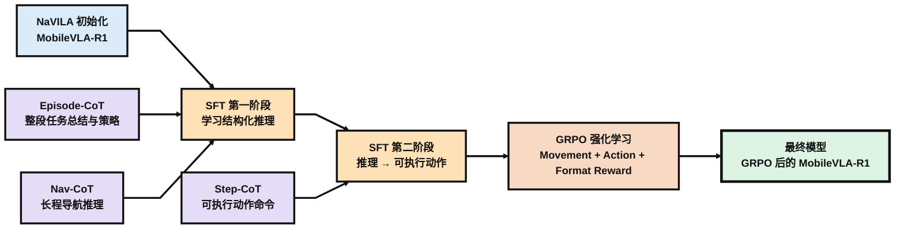

#### SFT 冷启动

SFT 又可以分成两个步骤。首先使用完整的 Episode-CoT 和 Nav-CoT 训练模型，使其学会按照 `<think>...</think><answer>...</answer>` 的格式进行推理。前者提供整个任务尺度的执行策略，后者提供长程导航过程中当前进度和下一步动作的判断，因此这一阶段主要解决的是“模型应该怎样思考和表达决策”。

随后再加入约 10K 条 Step-CoT。与前两种数据不同，Step-CoT 的 `<answer>` 中已经包含可以执行的速度和动作命令，例如前进速度、横向速度和 yaw 角速度等，这些输出可以被确定性地解析成机器人控制信号。因此第二步实际上是在前面已经建立的语义推理基础上，进一步学习如何把“应该怎么做”落到具体控制量上。

从训练方式上看，SFT 和普通语言模型监督微调没有本质区别。给定视觉、语言和一条 Gemini 生成的标准 CoT，模型按照 teacher forcing 学习标准答案中的下一个 token。也就是说，SFT 告诉模型的是：

```txt
对于这个输入，希望你尽可能复现这一条
<think> ... </think>
<answer> ... </answer>
```

这样可以很快建立稳定的输出格式和基本推理方式，但它仍然依赖 Gemini 给出的单条标准答案。如果某一种推理写法最终产生了更好的机器人动作，仅靠 SFT 本身并不会主动偏向这种结果，因此作者继续使用 GRPO 进行强化。

#### GRPO

GRPO 阶段不再为一个输入只提供一条固定的标准答案。对于同一个多模态输入 $I=(x,i)$，当前模型一次采样得到 $N$ 条不同的输出：

$$
o_1,o_2,\ldots,o_N
$$

论文训练时，每个样本生成 8 个 response，每个 optimization step 使用 5 个样本。Reward 有三个方面：

- Movement Reward比较预测速度方向和真实速度方向，使用 $V_x$、$V_y$、$V_{\text{yaw}}$ 三个连续控制量的余弦相似度：

$$
R_m=
\frac{
\mathbf{o}'^{\top}\mathbf{o}'^{*}
}{
\|\mathbf{o}'\|_2\|\mathbf{o}'^{*}\|_2
},
\qquad
\mathbf{o}'=(V_x,V_y,V_{\text{yaw}})
$$

- Action Reward 用于监督离散的高层动作。如果模型预测的动作 $a$ 与真实动作 $a^*$ 一致，则 reward 为 1，否则为 0：

$$
R_{\text{action}}
=
\begin{cases}
1, & a=a^* \\
0, & \text{otherwise}
\end{cases}
$$

- Format Reward 检查模型是否仍然保持：`<think>...</think><answer>...</answer>`这样的结构化输出格式：

$$
R_{\text{format}}
=
\begin{cases}
1, & \text{output satisfies format} \\
0, & \text{otherwise}
\end{cases}
$$

论文分别定义了三种 reward，但没有明确给出它们如何组合成最终 reward $r_i$，也没有报告三种 reward 的具体权重。消融实验表明，三个 Reward 在一起才能发挥出最好的效果。下面是对三种Reward的总结归纳：

| Reward          | 约束对象                 | 希望模型学到什么         |
| --------------- | ------------------------ | ------------------------ |
| Movement Reward | $V_x,V_y,V_{\text{yaw}}$ | 运动方向与真实控制一致   |
| Action Reward   | 离散动作 $a$             | 高层动作选择正确         |
| Format Reward   | `<think><answer>`        | 保持结构化、可解析的输出 |

GRPO 的关键不只是计算 reward，而是在同一组 response 之间进行相对比较。

假设同一个输入生成的 $N$ 个 response 分别得到：

$$
r_1,r_2,\ldots,r_N
$$

论文计算第 $i$ 个 response 的 advantage：

$$
A_i
=
r_i-
\frac{1}{N}
\sum_{j=1}^{N}r_j
$$

也就是说，一个 response 是否值得强化，不只取决于自己的 reward 有多大，而取决于它是否高于同一组 response 的平均 reward。

高于平均水平的 response 得到正 advantage，在之后的 policy update 中提高出现概率；低于平均水平的 response 得到负 advantage，则降低出现概率。

如果只按照 advantage 更新，模型可能会因为某个 response 的 reward 较高而一次性大幅提高它的概率，因此 GRPO 沿用了 PPO 中的 clipping 机制，将概率比值限制在 $1-\epsilon$ 到 $1+\epsilon$ 附近，并通过 `min` 选择更加保守的目标，从而限制单次 policy update 的幅度。

这样一来，GRPO 的完整过程就是先让当前模型针对同一个输入生成多个 response，根据 Movement、Action 和 Format 三种 reward 对这些 response 进行评价，再通过组内比较得到 advantage，最后利用 $J_{\mathrm{GRPO}}$ 提高较好 response 的生成概率、降低较差 response 的生成概率，同时通过 clipping 和 KL regularization 控制更新幅度。GRPO的流程大致如下所示。

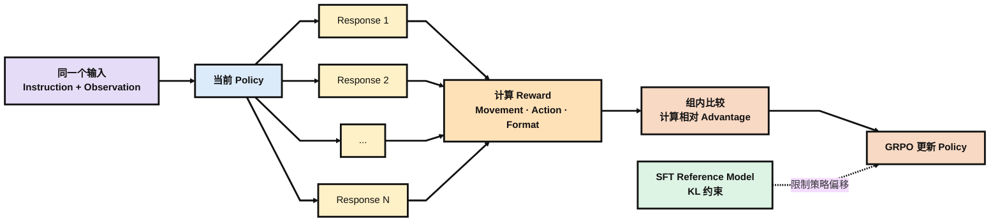


## FSR-VLN: 融合几何与图像两条路线的快慢推理

论文链接：

[FSR-VLN: Fast and Slow Reasoning for Vision-Language Navigation with Hierarchical Multi-modal Scene Graph](https://arxiv.org/abs/2509.13733)

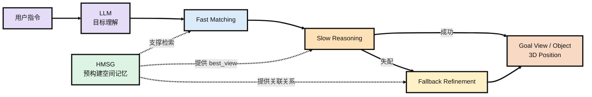


### 研究背景

FSR-VLN 研究的是在离线场景图已经构建完成的条件下，如何根据用户指令找到目标物体。系统的输入是一条文本或语音指令，输出则是目标物体对应的视图节点以及它在场景中的三维坐标。也就是说，这篇论文主要关注的是建图完成之后的目标理解、检索和定位，而不是在线探索或实时建图。

现有方法大致可以分成两条路线。一类是 OK-Robot、HOVSG 这样的几何语义地图或 3D 场景图，把 CLIP、OWL-ViT 等视觉模型的特征存到体素或物体节点中，检索时直接计算指令文本和节点特征之间的相似度。这类方法有明确的三维几何表示，目标一旦匹配到物体节点，就比较容易得到空间位置，但对目标的理解主要依赖 embedding 匹配。另一类方法则把环境表示成由历史图像组成的拓扑图，再直接利用 VLM 或长上下文模型在图像序列中寻找目标，语义推理能力更强，但缺少显式的物体级三维几何表示。FSR-VLN 想做的就是把这两种表示结合起来：既保留场景图中的几何和物体信息，也保留原始图像供 VLM 做进一步判断，因此在原有的 Floor–Room–Object 结构中加入了 View 节点，形成后面的 HMSG。两条路线和本文脉络如下所示。

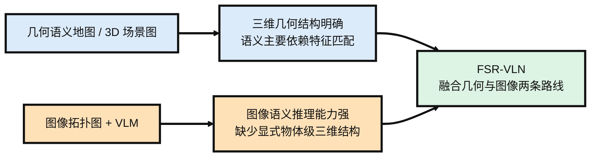

### HMSG

FSR-VLN 使用的是 Hierarchical Multi-modal Scene Graph（HMSG）。它并不是从头设计一种新的地图表示，而是在 HOVSG 原有的 Floor–Room–Object 三层场景图中加入了一层 View，用 View 把原始图像和三维物体连接起来。整体关系可以理解为 Floor 下面包含 Room，每个 Room 下面同时包含 View 和 Object；View 与它能够观测到的 Object 之间建立可见关系，不同 View 之间则根据相对位姿建立拓扑连接。这样一来，Floor 和 Room 仍然负责组织空间层级，Object 保留具体物体的三维包围盒、点云和语义特征，而 View 则保留机器人历史观测到的图像、相机位姿、CLIP 特征以及 VLM 生成的文字描述。

HMSG 的底层建图基本沿用了 HOVSG。机器人先通过 RGBD 相机和 LiDAR 采集数据，由 FAST-LIVO2 得到带位姿的点云和图像，再依次完成楼层划分、房间边界划分和物体实例聚类，得到原来的 Floor–Room–Object 场景图。这部分并不是 FSR-VLN 的主要创新，论文真正新增的是如何把历史图像作为 View 节点接入这套结构。具体来说，每个 View 根据相机位姿和房间边界确定所属 Room，同时由 VLM 为图像生成一段文字描述。

在 View 接入之后，系统还会为每个 Object 找到所有能够看到它的 View，并计算物体在这些视图中的平均深度，选择平均深度最小的那个作为该物体的 best_view。这个 best_view 后面很重要，因为在线推理时 Slow Reasoning 会直接用它对应的原始图像来核实 CLIP 找到的物体是否正确。除此之外，HOVSG 中的房间名称原本是直接给定的，而 FSR-VLN 改成让 GPT-4o 根据房间内 View 对应的图像内容推断房间名称。下面是在HOVSG基础上建立HMSG的流程图。

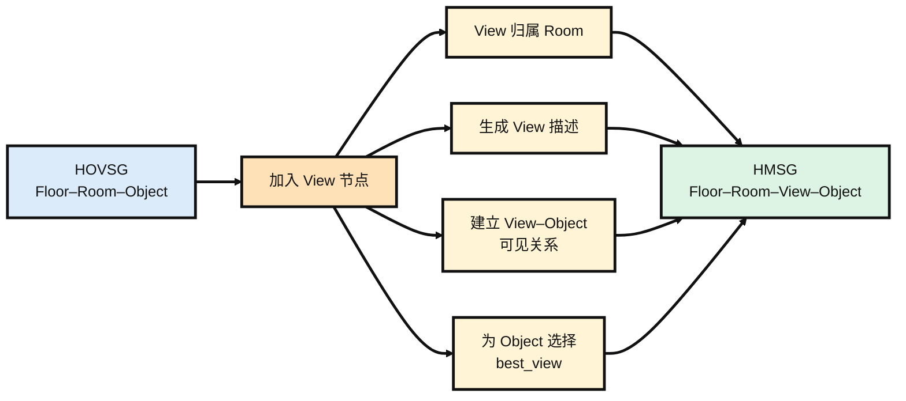


HMSG 的拓扑关系可以概括为 `Floor → Room → {View, Object}`。Floor 与 Room、Room 与 View/Object 之间是层级包含关系，用来组织场景中的空间层次；View 与 Object 之间建立可见关系，表示某个物体可以从哪些历史视角中被观测到；不同 View 之间则根据相对位姿建立无向拓扑边，用来描述机器人在各个历史观测位置之间的空间连接。这样，原本独立的三维物体节点和原始图像视角就通过 View–Object 的关系连接起来。下面是HMSG的各种节点的拓扑关系。


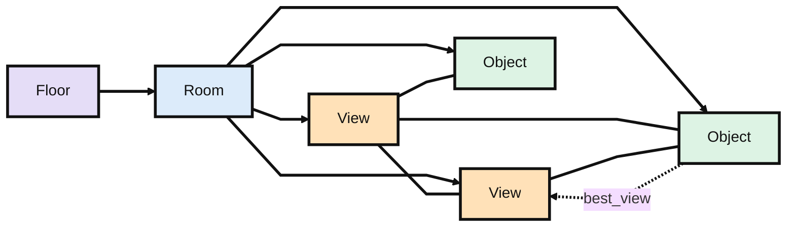


### 在线推理

在线推理首先由 LLM 对用户指令进行理解。对于“带我去办公室的蓝色圆柱凳”这类显式指令，LLM 会解析出房间和物体；对于“我累了，哪里能休息”这类隐式指令，则先推断用户真正需要寻找的目标物体。如果指令中包含房间信息，系统会先完成 Room 匹配，将后续搜索限制在对应房间内。在此基础上，View 和 Object 两层同时进行 CLIP 相似度匹配：Object 层得到一个候选目标物体，View 层则得到一个候选目标视图。这个阶段基本依赖 embedding 相似度，因此速度很快，但匹配结果不一定可靠。

接下来是 Slow Reasoning。系统取出候选 Object 在建图阶段已经保存好的 `best_view`，把对应原始图像交给 GPT-4o，判断指令描述的目标是否真的出现在图中。如果确认存在，就直接接受 Fast Matching 的结果；如果判断不可靠，则进行一次视图回退。系统先从其他 View 中筛出一个与目标语义最相关的候选视图，再将它与 Fast Matching 阶段得到的候选 View 进行视觉比较，确定最终目标视图。最后只在这个 View 所关联的 Object 中重新计算 CLIP 相似度，更新目标物体。目标确定之后，三维位置直接取自 Object 节点中已经保存的几何信息，交给后续导航与控制模块。整个回退只执行一次，论文没有设计循环验证或多轮重试。下面是整体的推理流程。

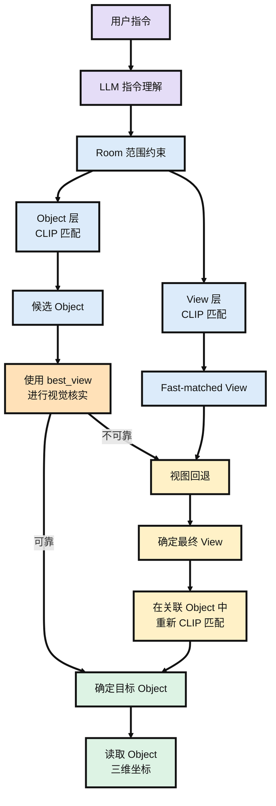

