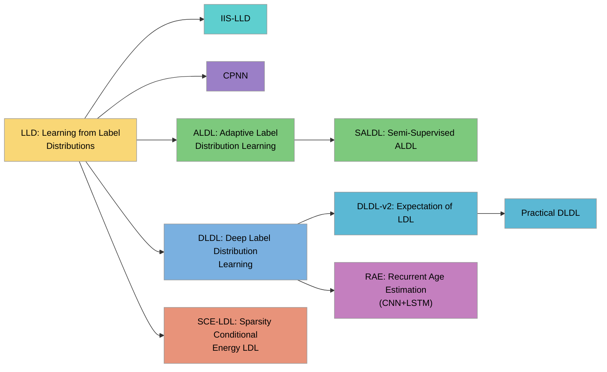

本文对标签分布学习的模型算法进行了代码实现，对整个LDL系列进行了一个总结。

<!-- more -->

# LDL面部年龄识别方法发展

LDL面部年龄识别系列方法以“年龄不是单点而是分布”为核心，将邻近年龄的描述度编码为标签分布，从而同时利用相邻年龄的相关性并缓解长尾稀缺（IIS-LLD）；在此基础上，ALDL按年龄阶段自适应调整分布宽度，契合儿童/老年变化快、中年变化慢的规律；当标注不足时，SALDL把自适应与半监督结合，引入未标注人脸以伪标签与分布迭代相互促进。深度化的DLDL把分布学习嵌入CNN，以KL作为训练目标；DLDL-v2进一步从理论上把Ranking视作学习c.d.f.的特例，并在同一网络中“分布学习+期望回归”联合优化以缩小训练–评测不一致，且在Morph/ChaLearn上以更少参数达成或刷新SOTA。分支工作如SCE-LDL以能量函数与稀疏约束提升分布表达能力；而序列化的RAE以CNN+LSTM建模同一身份的时间序列老化，适用于需要同一人的多张图像场景。LDL面部年龄识别系列发展方法脉络如下所示。




# 代码实现

本次代码实现围绕标签分布学习（Label Distribution Learning, LDL）在年龄估计任务中的若干内部变体展开，数据全部来自 MegaAge-Asian（数据集链接：<https://aistudio.baidu.com/datasetdetail/45324>）。由于官方仅提供 train 与 test 两个拆分，我们首先将两者汇合成一个样本池，统一执行“检测—对齐—清洗—特征化”的管线，再按 7:2:1 重新划分为 Train、Test、Val。Train 仅用于参数学习，Test 仅用于超参数选择与早停触发，Val 作为最终盲测集合只在最后一次性评估。为了减少随机性对对比结论的影响，划分在固定随机种子下生成，并将划分文件随代码一并固化，所有后续模型严格在同一份切分上训练与评测。

对齐与清洗阶段采用基于 5 点关键点的仿射对齐流程：先用稳定的人脸检测器拿到关键点，再将人脸规整到统一模板坐标系，输出对齐到定尺度的人脸图像。图像统一做 RGB 转换、[0,1] 归一化与 ImageNet 统计量标准化，训练时启用轻量随机翻转 / 颜色抖动 / 缩放裁剪，推理仅保留确定性归一化。无法稳定检测到人脸、或人脸框极小/严重遮挡的样本不做修复，直接丢弃并将文件名记录到失败清单；按该准则，最终剔除了两百余张异常样本，其余样本进入特征抽取环节。

特征抽取器选用 MiVOLO（GitHub：<https://github.com/WildChlamydia/MiVOLO>；论文：<https://arxiv.org/abs/2307.04616>），在本项目中仅作为“冻结的”向量化器使用，不做端到端微调。我们启用人脸与人体两路分支并在特征维上拼接，得到每张图 768 维的 embedding；为避免表征差异干扰 LDL 族内对比，后续的所有模型都只“吃向量不吃原图”。特征在 Train 上做 z-score 标准化（均值与方差在 Train 估计，并在 Test/Val 上复用），正式实验不做降维；虽然在调试阶段尝试过 PCA→256 维对速度有帮助，但为保证变量可控，报告中的比较一律保持 768 维输入。

标签空间取闭区间 [0,70] 的整数年龄，并用高斯核把单值标签离散化为 71 维分布，σ∈{2,3,5} 作为可调超参数。模型输出同为 71 维分布，主损失采用分布级交叉熵 / KL 散度；部分变体叠加期望年龄的 L1 约束（将分布期望 E[y] 与真值做 MAE，系数 λ∈{0.5,1.0}），以提升数值可解释性。推理阶段统一以分布期望作为实值预测。优化器使用 AdamW，学习率在 {1e-3, 3e-4} 小网格搜索、权重衰减在 {0, 1e-4} 选择；批量大小依据显存与 AMP 配置在 128–256 之间取值。早停以 Test 上的主损失为监控量，patience 设为 3–5；每个变体选出最优超参数与最优 epoch 后，会用 Train+Test 合并重训定稿模型，最终仅在 Val 上计算 MAE 与 CS5 并固化报表。

LDL 族内的建模差异限定在“如何从 768 维向量映射到 71 维分布”与“如何构造/平滑监督分布”两个层面。CPNN 路线以多层感知机实现 768→71 的映射（例如 768→512→256→71，ReLU+Dropout，softmax 输出），主损失为分布交叉熵，选配 λ·MAE 的期望正则，用以考察网络深度与正则强度对稳定性的影响；DLDL-v2 保持相同的 768→…→71 头部，但目标分布固定为 σ-高斯软标签；Practical-DLDL 则在标签空间或样本邻域内进一步做平滑（如 k∈{3,5,7} 的邻域聚合），用于缓解离散标签噪声。整个项目不引入外部对比模型，仅在“相同特征、相同协议”下做 LDL 族内的有控制变量的比较，问题聚焦于“分布建模方式如何影响年龄估计”的实证结论，而非追求跨方法的绝对最优数值。


IIS-LLD将“单一真实年龄”替换为覆盖相邻年龄的标签分布，学习条件分布 p(y|x) 去贴近先验分布 D，通过最小化 KL(D‖p) 等价地最大化带软标签的对数似然来实现；原论文同时给出了 IIS-LLD 与 CPNN 两条路径，并给出高斯/三角等典型先验分布以体现“邻近年龄相似、距离越远权重越低”的原则。

```c++
#include <iostream>
using namespace std;

int main()
{
    cout << "Hello, world!\n";
    return 0;
}
```


在本项目里，我们用 MiVOLO 冻结特征得到 768 维向量，采用一层线性映射加 softmax 直接实现对数线性模型，输出 71 维年龄分布（0–70）；监督分布用离散高斯并网格 σ∈{2,3,5}，以 KL 作为主损失，推理时取期望作为预测值并以 MAE 与 CS(5)评估。实践经验表明高斯分布通常优于三角，且分布过窄或过宽都会恶化性能，因此 σ 需要在开发集上择优。

```python
import numpy as np
import torch
import torch.nn.functional as F
from torch import nn
from torch.utils.data import Dataset, DataLoader
from dataclasses import dataclass

def gaussian_label_distribution(y: int, num_classes: int = 71, sigma: float = 3.0):
    xs = np.arange(num_classes, dtype=np.float32)
    w = np.exp(-0.5 * ((xs - y) / sigma) ** 2)
    w /= w.sum() + 1e-12
    return w.astype(np.float32)

class LDLSet(Dataset):
    def __init__(self, X: np.ndarray, y: np.ndarray, num_classes=71, sigma=3.0):
        self.X = X.astype(np.float32)
        self.y = y.astype(np.int64)
        self.D = np.stack([gaussian_label_distribution(int(t), num_classes, sigma) for t in y]).astype(np.float32)
    def __len__(self): return len(self.y)
    def __getitem__(self, i):
        return torch.from_numpy(self.X[i]), torch.from_numpy(self.D[i]), int(self.y[i])

class LinearLDL(nn.Module):
    # p(y|x) = softmax(Wx + b)
    def __init__(self, in_dim=768, num_classes=71):
        super().__init__()
        self.fc = nn.Linear(in_dim, num_classes)
    def forward(self, x):
        return self.fc(x)  # logits

@dataclass
class CFG:
    in_dim: int = 768
    num_classes: int = 71
    sigma: float = 3.0
    lr: float = 3e-4
    weight_decay: float = 1e-4
    batch_size: int = 256
    max_epochs: int = 50
    patience: int = 4
    device: str = "cuda" if torch.cuda.is_available() else "cpu"

def make_loaders(paths: dict, cfg: CFG):
    Xtr, ytr = np.load(paths["X_train"]), np.load(paths["y_train"])
    Xte, yte = np.load(paths["X_test"]),  np.load(paths["y_test"])
    Xva, yva = np.load(paths["X_val"]),   np.load(paths["y_val"])
    tr = LDLSet(Xtr, ytr, cfg.num_classes, cfg.sigma)
    te = LDLSet(Xte, yte, cfg.num_classes, cfg.sigma)  # used as dev for early stop
    va = LDLSet(Xva, yva, cfg.num_classes, cfg.sigma)
    tr_loader = DataLoader(tr, batch_size=cfg.batch_size, shuffle=True,  num_workers=2, pin_memory=True)
    te_loader = DataLoader(te, batch_size=cfg.batch_size, shuffle=False, num_workers=2, pin_memory=True)
    va_loader = DataLoader(va, batch_size=cfg.batch_size, shuffle=False, num_workers=2, pin_memory=True)
    return tr_loader, te_loader, va_loader

@torch.no_grad()
def evaluate(model, loader, cfg: CFG):
    model.eval()
    bins = torch.arange(cfg.num_classes, dtype=torch.float32, device=cfg.device)
    total, loss_sum, mae_sum, cs5_sum = 0, 0.0, 0.0, 0.0
    for x, d, y in loader:
        x, d = x.to(cfg.device), d.to(cfg.device)
        logits = model(x)
        logp = F.log_softmax(logits, dim=1)
        loss = F.kl_div(logp, d, reduction="batchmean")  # KL(target||pred)
        p = logp.exp()
        yhat = (p * bins.unsqueeze(0)).sum(1)
        mae = (yhat - torch.tensor(y, dtype=torch.float32, device=cfg.device)).abs()
        cs5 = (mae <= 5.0).float()
        bsz = x.size(0)
        total += bsz
        loss_sum += loss.item() * bsz
        mae_sum  += mae.sum().item()
        cs5_sum  += cs5.sum().item()
    return loss_sum/total, mae_sum/total, cs5_sum/total

def train_iis_ldl(paths: dict, cfg: CFG):
    tr_loader, te_loader, va_loader = make_loaders(paths, cfg)
    model = LinearLDL(cfg.in_dim, cfg.num_classes).to(cfg.device)
    opt = torch.optim.AdamW(model.parameters(), lr=cfg.lr, weight_decay=cfg.weight_decay)
    best_loss, best_state, no_improve = float("inf"), None, 0

    for epoch in range(1, cfg.max_epochs + 1):
        model.train()
        for x, d, _ in tr_loader:
            x, d = x.to(cfg.device), d.to(cfg.device)
            logp = F.log_softmax(model(x), dim=1)
            loss = F.kl_div(logp, d, reduction="batchmean")
            opt.zero_grad(set_to_none=True)
            loss.backward()
            opt.step()

        te_loss, te_mae, te_cs5 = evaluate(model, te_loader, cfg)
        print(f"[{epoch:02d}] dev KL={te_loss:.4f}  MAE={te_mae:.3f}  CS5={te_cs5:.3f}")
        if te_loss + 1e-6 < best_loss:
            best_loss, best_state, no_improve = te_loss, {k:v.detach().cpu().clone() for k,v in model.state_dict().items()}, 0
        else:
            no_improve += 1
            if no_improve >= cfg.patience:
                print("Early stopped."); break

    if best_state is not None:
        model.load_state_dict(best_state)
    val_loss, val_mae, val_cs5 = evaluate(model, va_loader, cfg)
    print(f"[VAL] KL={val_loss:.4f}  MAE={val_mae:.3f}  CS5={val_cs5:.3f}")
    return model
```
CPNN将标签分布学习用多层感知机来实现，把输入向量映射到年龄标签空间的概率分布，并用 KL(D‖p) 让输出分布逼近由真实年龄离散化得到的先验分布。相较线性对数模型，CPNN通过非线性层与丢弃正则提升表征能力，能够在保持“邻近年龄相似”的软监督假设下，更充分地拟合复杂特征与标签分布之间的关系，同时保留以分布期望作为最终实值预测的推理方式。

在本项目中，我们继续使用 MiVOLO 冻结特征得到的 768 维 embedding，采用 768→512→256→71 的 MLP 头部（ReLU+Dropout，末层 softmax）输出 71 维年龄分布。监督分布仍用离散高斯，σ 从 {2,3,5} 网格选取；主损失为 KL，另可选叠加 λ·MAE 的期望一致性正则（将输出分布的期望与真值做 L1），以提升数值可解释性与稳定性。训练与早停完全沿用前述协议，评估指标为 MAE 与 CS(5)。

```python
import numpy as np
import torch
import torch.nn.functional as F
from torch import nn
from torch.utils.data import Dataset, DataLoader
from dataclasses import dataclass

# ---------- target distribution ----------
def gaussian_label_distribution(y: int, num_classes: int = 71, sigma: float = 3.0):
    xs = np.arange(num_classes, dtype=np.float32)
    w = np.exp(-0.5 * ((xs - y) / sigma) ** 2)
    w /= w.sum() + 1e-12
    return w.astype(np.float32)

# ---------- dataset ----------
class LDLSet(Dataset):
    def __init__(self, X: np.ndarray, y: np.ndarray, num_classes=71, sigma=3.0):
        self.X = X.astype(np.float32)
        self.y = y.astype(np.int64)
        self.D = np.stack([gaussian_label_distribution(int(t), num_classes, sigma) for t in y]).astype(np.float32)
    def __len__(self): return len(self.y)
    def __getitem__(self, i):
        return torch.from_numpy(self.X[i]), torch.from_numpy(self.D[i]), int(self.y[i])

# ---------- model ----------
class CPNN(nn.Module):
    # 768 -> 512 -> 256 -> 71, ReLU + Dropout, softmax at loss
    def __init__(self, in_dim=768, num_classes=71, pdrop=0.2):
        super().__init__()
        self.net = nn.Sequential(
            nn.Linear(in_dim, 512),
            nn.ReLU(inplace=True),
            nn.Dropout(pdrop),
            nn.Linear(512, 256),
            nn.ReLU(inplace=True),
            nn.Dropout(pdrop),
            nn.Linear(256, num_classes),
        )
    def forward(self, x):
        return self.net(x)  # logits

# ---------- config ----------
@dataclass
class CFG:
    in_dim: int = 768
    num_classes: int = 71
    sigma: float = 3.0
    lr: float = 3e-4
    weight_decay: float = 1e-4
    batch_size: int = 256
    max_epochs: int = 60
    patience: int = 5
    device: str = "cuda" if torch.cuda.is_available() else "cpu"
    pdrop: float = 0.2
    lambda_expect: float = 0.0  # set to 0.5 or 1.0 to enable expectation L1 regularizer

# ---------- loaders ----------
def make_loaders(paths: dict, cfg: CFG):
    Xtr, ytr = np.load(paths["X_train"]), np.load(paths["y_train"])
    Xte, yte = np.load(paths["X_test"]),  np.load(paths["y_test"])
    Xva, yva = np.load(paths["X_val"]),   np.load(paths["y_val"])
    tr = LDLSet(Xtr, ytr, cfg.num_classes, cfg.sigma)
    te = LDLSet(Xte, yte, cfg.num_classes, cfg.sigma)
    va = LDLSet(Xva, yva, cfg.num_classes, cfg.sigma)
    tr_loader = DataLoader(tr, batch_size=cfg.batch_size, shuffle=True,  num_workers=2, pin_memory=True)
    te_loader = DataLoader(te, batch_size=cfg.batch_size, shuffle=False, num_workers=2, pin_memory=True)
    va_loader = DataLoader(va, batch_size=cfg.batch_size, shuffle=False, num_workers=2, pin_memory=True)
    return tr_loader, te_loader, va_loader

# ---------- evaluation ----------
@torch.no_grad()
def evaluate(model, loader, cfg: CFG):
    model.eval()
    bins = torch.arange(cfg.num_classes, dtype=torch.float32, device=cfg.device)
    total, loss_sum, mae_sum, cs5_sum = 0, 0.0, 0.0, 0.0
    for x, d, y in loader:
        x, d = x.to(cfg.device), d.to(cfg.device)
        logits = model(x)
        logp = F.log_softmax(logits, dim=1)
        loss = F.kl_div(logp, d, reduction="batchmean")
        p = logp.exp()
        yhat = (p * bins.unsqueeze(0)).sum(1)
        mae = (yhat - torch.tensor(y, dtype=torch.float32, device=cfg.device)).abs()
        cs5 = (mae <= 5.0).float()
        bsz = x.size(0)
        total += bsz
        loss_sum += loss.item() * bsz
        mae_sum  += mae.sum().item()
        cs5_sum  += cs5.sum().item()
    return loss_sum/total, mae_sum/total, cs5_sum/total

# ---------- training ----------
def train_cpnn(paths: dict, cfg: CFG):
    tr_loader, te_loader, va_loader = make_loaders(paths, cfg)
    model = CPNN(cfg.in_dim, cfg.num_classes, cfg.pdrop).to(cfg.device)
    opt = torch.optim.AdamW(model.parameters(), lr=cfg.lr, weight_decay=cfg.weight_decay)

    bins = torch.arange(cfg.num_classes, dtype=torch.float32, device=cfg.device)
    best_loss, best_state, no_improve = float("inf"), None, 0

    for epoch in range(1, cfg.max_epochs + 1):
        model.train()
        for x, d, y in tr_loader:
            x, d = x.to(cfg.device), d.to(cfg.device)
            logits = model(x)
            logp = F.log_softmax(logits, dim=1)
            kl = F.kl_div(logp, d, reduction="batchmean")

            loss = kl
            if cfg.lambda_expect > 0.0:
                with torch.no_grad():
                    y_true = torch.tensor(y, dtype=torch.float32, device=cfg.device)
                p = logp.exp()
                yhat = (p * bins.unsqueeze(0)).sum(1)
                loss = loss + cfg.lambda_expect * (yhat - y_true).abs().mean()

            opt.zero_grad(set_to_none=True)
            loss.backward()
            opt.step()

        te_loss, te_mae, te_cs5 = evaluate(model, te_loader, cfg)
        print(f"[{epoch:02d}] dev KL={te_loss:.4f}  MAE={te_mae:.3f}  CS5={te_cs5:.3f}")
        if te_loss + 1e-6 < best_loss:
            best_loss, best_state, no_improve = te_loss, {k:v.detach().cpu().clone() for k,v in model.state_dict().items()}, 0
        else:
            no_improve += 1
            if no_improve >= cfg.patience:
                print("Early stopped."); break

    if best_state is not None:
        model.load_state_dict(best_state)
    val_loss, val_mae, val_cs5 = evaluate(model, va_loader, cfg)
    print(f"[VAL] KL={val_loss:.4f}  MAE={val_mae:.3f}  CS5={val_cs5:.3f}")
    return model

# Example:
# paths = {"X_train":"X_train.npy","y_train":"y_train.npy",
#          "X_test":"X_test.npy","y_test":"y_test.npy",
#          "X_val":"X_val.npy","y_val":"y_val.npy"}
# model = train_cpnn(paths, CFG(sigma=3.0, lambda_expect=0.5))

```

DLDL将真实年龄离散化为固定形状的标签分布（常用高斯或三角），用 KL(D‖p) 训练网络直接拟合整条分布，推理阶段以输出分布的期望作为实值预测。相较把年龄当作单点回归，DLDL显式编码了“邻近年龄更相似”的先验；相较 IIS-LLD/CPNN 的差别主要在“训练目标固定为某一形状的软标签分布”，不额外引入期望一致性或自适应分布等正则项。

在本项目里，我们继续采用 MiVOLO 冻结得到的 768 维向量作为输入，使用 768→512→71 的 MLP 头部输出 71 维年龄分布，监督分布取离散高斯并在 σ∈{2,3,5} 上网格搜索，主损失为 KL，早停依据开发集上的 KL。评估指标为 MAE 与 CS(5)，该实现对应“纯 DLDL”版本，不包含期望 L1（这会在后续的 DLDL-v2 中加入）。

```python
import numpy as np
import torch
import torch.nn.functional as F
from torch import nn
from torch.utils.data import Dataset, DataLoader
from dataclasses import dataclass

# ----- target distribution -----
def gaussian_label_distribution(y: int, num_classes: int = 71, sigma: float = 3.0):
    xs = np.arange(num_classes, dtype=np.float32)
    w = np.exp(-0.5 * ((xs - y) / sigma) ** 2)
    w /= w.sum() + 1e-12
    return w.astype(np.float32)

# ----- dataset -----
class LDLSet(Dataset):
    def __init__(self, X: np.ndarray, y: np.ndarray, num_classes=71, sigma=3.0):
        self.X = X.astype(np.float32)
        self.y = y.astype(np.int64)
        self.D = np.stack([gaussian_label_distribution(int(t), num_classes, sigma) for t in y]).astype(np.float32)
    def __len__(self): return len(self.y)
    def __getitem__(self, i):
        return torch.from_numpy(self.X[i]), torch.from_numpy(self.D[i]), int(self.y[i])

# ----- model (DLDL head) -----
class DLDLHead(nn.Module):
    # 768 -> 512 -> 71, ReLU + Dropout, softmax is applied in loss
    def __init__(self, in_dim=768, num_classes=71, pdrop=0.1):
        super().__init__()
        self.net = nn.Sequential(
            nn.Linear(in_dim, 512),
            nn.ReLU(inplace=True),
            nn.Dropout(pdrop),
            nn.Linear(512, num_classes),
        )
    def forward(self, x):
        return self.net(x)  # logits

# ----- config -----
@dataclass
class CFG:
    in_dim: int = 768
    num_classes: int = 71
    sigma: float = 3.0
    lr: float = 3e-4
    weight_decay: float = 1e-4
    batch_size: int = 256
    max_epochs: int = 60
    patience: int = 5
    device: str = "cuda" if torch.cuda.is_available() else "cpu"
    pdrop: float = 0.1

# ----- loaders -----
def make_loaders(paths: dict, cfg: CFG):
    Xtr, ytr = np.load(paths["X_train"]), np.load(paths["y_train"])
    Xte, yte = np.load(paths["X_test"]),  np.load(paths["y_test"])
    Xva, yva = np.load(paths["X_val"]),   np.load(paths["y_val"])
    tr = LDLSet(Xtr, ytr, cfg.num_classes, cfg.sigma)
    te = LDLSet(Xte, yte, cfg.num_classes, cfg.sigma)  # dev for early stop
    va = LDLSet(Xva, yva, cfg.num_classes, cfg.sigma)
    tr_loader = DataLoader(tr, batch_size=cfg.batch_size, shuffle=True,  num_workers=2, pin_memory=True)
    te_loader = DataLoader(te, batch_size=cfg.batch_size, shuffle=False, num_workers=2, pin_memory=True)
    va_loader = DataLoader(va, batch_size=cfg.batch_size, shuffle=False, num_workers=2, pin_memory=True)
    return tr_loader, te_loader, va_loader

# ----- evaluation -----
@torch.no_grad()
def evaluate(model, loader, cfg: CFG):
    model.eval()
    bins = torch.arange(cfg.num_classes, dtype=torch.float32, device=cfg.device)
    total, loss_sum, mae_sum, cs5_sum = 0, 0.0, 0.0, 0.0
    for x, d, y in loader:
        x, d = x.to(cfg.device), d.to(cfg.device)
        logits = model(x)
        logp = F.log_softmax(logits, dim=1)
        loss = F.kl_div(logp, d, reduction="batchmean")  # KL(target||pred)
        p = logp.exp()
        yhat = (p * bins.unsqueeze(0)).sum(1)
        mae = (yhat - torch.tensor(y, dtype=torch.float32, device=cfg.device)).abs()
        cs5 = (mae <= 5.0).float()
        bsz = x.size(0)
        total += bsz
        loss_sum += loss.item() * bsz
        mae_sum  += mae.sum().item()
        cs5_sum  += cs5.sum().item()
    return loss_sum/total, mae_sum/total, cs5_sum/total

# ----- training -----
def train_dldl(paths: dict, cfg: CFG):
    tr_loader, te_loader, va_loader = make_loaders(paths, cfg)
    model = DLDLHead(cfg.in_dim, cfg.num_classes, cfg.pdrop).to(cfg.device)
    opt = torch.optim.AdamW(model.parameters(), lr=cfg.lr, weight_decay=cfg.weight_decay)

    best_loss, best_state, no_improve = float("inf"), None, 0
    for epoch in range(1, cfg.max_epochs + 1):
        model.train()
        for x, d, _ in tr_loader:
            x, d = x.to(cfg.device), d.to(cfg.device)
            logits = model(x)
            logp = F.log_softmax(logits, dim=1)
            loss = F.kl_div(logp, d, reduction="batchmean")
            opt.zero_grad(set_to_none=True)
            loss.backward()
            opt.step()

        te_loss, te_mae, te_cs5 = evaluate(model, te_loader, cfg)
        print(f"[{epoch:02d}] dev KL={te_loss:.4f}  MAE={te_mae:.3f}  CS5={te_cs5:.3f}")
        if te_loss + 1e-6 < best_loss:
            best_loss, best_state, no_improve = te_loss, {k:v.detach().cpu().clone() for k,v in model.state_dict().items()}, 0
        else:
            no_improve += 1
            if no_improve >= cfg.patience:
                print("Early stopped."); break

    if best_state is not None:
        model.load_state_dict(best_state)
    val_loss, val_mae, val_cs5 = evaluate(model, va_loader, cfg)
    print(f"[VAL] KL={val_loss:.4f}  MAE={val_mae:.3f}  CS5={val_cs5:.3f}")
    return model

# Example:
# paths = {"X_train":"X_train.npy","y_train":"y_train.npy",
#          "X_test":"X_test.npy","y_test":"y_test.npy",
#          "X_val":"X_val.npy","y_val":"y_val.npy"}
# model = train_dldl(paths, CFG(sigma=3.0))

```

DLDL-v2在固定形状的标签分布监督（如高斯/三角）的基础上，将“分布拟合”的KL项与“期望一致性”的L1项联合优化：在最小化 KL(D‖p) 的同时，约束输出分布的期望 E[p] 接近真实年龄 y（用 |E[p]−y| 表达）。这样做一方面保留了邻近年龄相似性的软监督，另一方面把训练目标与评价指标（MAE）对齐，避免仅用分布匹配时对数值误差不敏感的问题。推理仍取期望作为实值预测。

在本项目中延续向量输入与统一协议：输入为 MiVOLO 冻结得到的 768 维 embedding，使用 768→512→71 的 MLP 头部输出年龄分布；监督分布采用离散高斯并在 σ∈{2,3,5} 上网格，联合损失为 KL + λ·MAEexp，其中 MAEexp=|E[p]−y| 的批均值，λ 可取 {0.5,1.0} 并在开发集上选择。早停依据开发集上的联合目标，最终以 MAE 与 CS(5) 报告性能。

```python
import numpy as np
import torch
import torch.nn.functional as F
from torch import nn
from torch.utils.data import Dataset, DataLoader
from dataclasses import dataclass

# ----- target distribution -----
def gaussian_label_distribution(y: int, num_classes: int = 71, sigma: float = 3.0):
    xs = np.arange(num_classes, dtype=np.float32)
    w = np.exp(-0.5 * ((xs - y) / sigma) ** 2)
    w /= w.sum() + 1e-12
    return w.astype(np.float32)

# ----- dataset -----
class LDLSet(Dataset):
    def __init__(self, X: np.ndarray, y: np.ndarray, num_classes=71, sigma=3.0):
        self.X = X.astype(np.float32)
        self.y = y.astype(np.int64)
        self.D = np.stack([gaussian_label_distribution(int(t), num_classes, sigma) for t in y]).astype(np.float32)
    def __len__(self): return len(self.y)
    def __getitem__(self, i):
        return torch.from_numpy(self.X[i]), torch.from_numpy(self.D[i]), int(self.y[i])

# ----- model (DLDL-v2 head) -----
class DLDL2Head(nn.Module):
    # 768 -> 512 -> 71, ReLU + Dropout; softmax is applied in loss
    def __init__(self, in_dim=768, num_classes=71, pdrop=0.1):
        super().__init__()
        self.net = nn.Sequential(
            nn.Linear(in_dim, 512),
            nn.ReLU(inplace=True),
            nn.Dropout(pdrop),
            nn.Linear(512, num_classes),
        )
    def forward(self, x):
        return self.net(x)  # logits

# ----- config -----
@dataclass
class CFG:
    in_dim: int = 768
    num_classes: int = 71
    sigma: float = 3.0
    lr: float = 3e-4
    weight_decay: float = 1e-4
    batch_size: int = 256
    max_epochs: int = 60
    patience: int = 5
    device: str = "cuda" if torch.cuda.is_available() else "cpu"
    pdrop: float = 0.1
    lambda_expect: float = 0.5  # expectation consistency weight (0.5 or 1.0)

# ----- loaders -----
def make_loaders(paths: dict, cfg: CFG):
    Xtr, ytr = np.load(paths["X_train"]), np.load(paths["y_train"])
    Xte, yte = np.load(paths["X_test"]),  np.load(paths["y_test"])
    Xva, yva = np.load(paths["X_val"]),   np.load(paths["y_val"])
    tr = LDLSet(Xtr, ytr, cfg.num_classes, cfg.sigma)
    te = LDLSet(Xte, yte, cfg.num_classes, cfg.sigma)  # dev for early stop
    va = LDLSet(Xva, yva, cfg.num_classes, cfg.sigma)
    tr_loader = DataLoader(tr, batch_size=cfg.batch_size, shuffle=True,  num_workers=2, pin_memory=True)
    te_loader = DataLoader(te, batch_size=cfg.batch_size, shuffle=False, num_workers=2, pin_memory=True)
    va_loader = DataLoader(va, batch_size=cfg.batch_size, shuffle=False, num_workers=2, pin_memory=True)
    return tr_loader, te_loader, va_loader

# ----- evaluation (uses the same joint objective) -----
@torch.no_grad()
def evaluate(model, loader, cfg: CFG):
    model.eval()
    bins = torch.arange(cfg.num_classes, dtype=torch.float32, device=cfg.device)
    total, loss_sum, mae_sum, cs5_sum = 0, 0.0, 0.0, 0.0
    for x, d, y in loader:
        x, d = x.to(cfg.device), d.to(cfg.device)
        y_true = torch.tensor(y, dtype=torch.float32, device=cfg.device)
        logits = model(x)
        logp = F.log_softmax(logits, dim=1)
        p = logp.exp()
        kl = F.kl_div(logp, d, reduction="batchmean")
        yhat = (p * bins.unsqueeze(0)).sum(1)
        mae = (yhat - y_true).abs().mean()
        loss = kl + cfg.lambda_expect * mae

        cs5 = (yhat - y_true).abs() <= 5.0
        bsz = x.size(0)
        total += bsz
        loss_sum += loss.item() * bsz
        mae_sum  += (yhat - y_true).abs().sum().item()
        cs5_sum  += cs5.float().sum().item()
    return loss_sum/total, mae_sum/total, cs5_sum/total

# ----- training -----
def train_dldl_v2(paths: dict, cfg: CFG):
    tr_loader, te_loader, va_loader = make_loaders(paths, cfg)
    model = DLDL2Head(cfg.in_dim, cfg.num_classes, cfg.pdrop).to(cfg.device)
    opt = torch.optim.AdamW(model.parameters(), lr=cfg.lr, weight_decay=cfg.weight_decay)

    bins = torch.arange(cfg.num_classes, dtype=torch.float32, device=cfg.device)
    best_obj, best_state, no_improve = float("inf"), None, 0

    for epoch in range(1, cfg.max_epochs + 1):
        model.train()
        for x, d, y in tr_loader:
            x, d = x.to(cfg.device), d.to(cfg.device)
            y_true = torch.tensor(y, dtype=torch.float32, device=cfg.device)
            logits = model(x)
            logp = F.log_softmax(logits, dim=1)
            p = logp.exp()

            kl = F.kl_div(logp, d, reduction="batchmean")
            yhat = (p * bins.unsqueeze(0)).sum(1)
            mae_exp = (yhat - y_true).abs().mean()
            loss = kl + cfg.lambda_expect * mae_exp

            opt.zero_grad(set_to_none=True)
            loss.backward()
            opt.step()

        dev_obj, dev_mae, dev_cs5 = evaluate(model, te_loader, cfg)
        print(f"[{epoch:02d}] dev objective={dev_obj:.4f}  MAE={dev_mae:.3f}  CS5={dev_cs5:.3f}")
        if dev_obj + 1e-6 < best_obj:
            best_obj, best_state, no_improve = dev_obj, {k:v.detach().cpu().clone() for k,v in model.state_dict().items()}, 0
        else:
            no_improve += 1
            if no_improve >= cfg.patience:
                print("Early stopped."); break

    if best_state is not None:
        model.load_state_dict(best_state)
    val_obj, val_mae, val_cs5 = evaluate(model, va_loader, cfg)
    print(f"[VAL] objective={val_obj:.4f}  MAE={val_mae:.3f}  CS5={val_cs5:.3f}")
    return model

# Example:
# paths = {"X_train":"X_train.npy","y_train":"y_train.npy",
#          "X_test":"X_test.npy","y_test":"y_test.npy",
#          "X_val":"X_val.npy","y_val":"y_val.npy"}
# model = train_dldl_v2(paths, CFG(sigma=3.0, lambda_expect=0.5))

```

Practical-DLDL在固定形状软标签的基础上强调“只在合理邻域内分配概率”，将监督分布截断到 [y−k, y+k] 的局部窗口并在其中重新归一化，远离真值的尾部直接置零，以降低噪声与长尾对训练的干扰。窗口内的形状可以是高斯、三角或平顶，分别对应“中心更高、边缘更低”的连续先验、“线性衰减”的简单先验，以及“窗口内等权”的最稳健先验；经验上 k 取 3/5/7 较常见，可在开发集用网格选择。

在本项目中我们延续向量输入与统一协议：输入为 MiVOLO 冻结得到的 768 维 embedding，头部采用 768→512→71 的 MLP 输出分布，主损失为 KL。监督分布由形状 shape∈{gaussian, triangular, flat} 与窗口宽度 k 控制，其中 gaussian 还可设置 σ（先算全局高斯再按窗口截断并归一化）。训练沿用早停，评估以 MAE 与 CS(5)，推理取分布期望作为年龄预测。

```python
import numpy as np
import torch
import torch.nn.functional as F
from torch import nn
from torch.utils.data import Dataset, DataLoader
from dataclasses import dataclass

# ----- target distributions with window truncation -----
def gaussian_truncated(y: int, num_classes: int, sigma: float, k: int):
    xs = np.arange(num_classes, dtype=np.float32)
    w = np.exp(-0.5 * ((xs - y) / sigma) ** 2)
    if k is not None and k >= 0:
        mask = (xs >= y - k) & (xs <= y + k)
        w = w * mask.astype(np.float32)
    s = w.sum()
    w = w / (s + 1e-12)
    return w.astype(np.float32)

def triangular_window(y: int, num_classes: int, k: int):
    xs = np.arange(num_classes, dtype=np.float32)
    # height linearly decays to 0 at distance k; when k=0 this is one-hot
    w = np.maximum(0.0, (k + 1) - np.abs(xs - y))
    s = w.sum()
    w = w / (s + 1e-12)
    return w.astype(np.float32)

def flat_window(y: int, num_classes: int, k: int):
    xs = np.arange(num_classes, dtype=np.float32)
    w = ((xs >= y - k) & (xs <= y + k)).astype(np.float32)
    s = w.sum()
    w = w / (s + 1e-12)
    return w.astype(np.float32)

def build_target(y: int, num_classes: int, shape: str, k: int, sigma: float):
    if shape == "gaussian":
        return gaussian_truncated(y, num_classes, sigma, k)
    elif shape == "triangular":
        return triangular_window(y, num_classes, k)
    elif shape == "flat":
        return flat_window(y, num_classes, k)
    else:
        raise ValueError(f"Unknown shape: {shape}")

# ----- dataset -----
class LDLSet(Dataset):
    def __init__(self, X: np.ndarray, y: np.ndarray, num_classes=71, shape="gaussian", k=5, sigma=3.0):
        self.X = X.astype(np.float32)
        self.y = y.astype(np.int64)
        self.num_classes, self.shape, self.k, self.sigma = num_classes, shape, k, sigma
        self.D = np.stack([build_target(int(t), num_classes, shape, k, sigma) for t in y]).astype(np.float32)
    def __len__(self): return len(self.y)
    def __getitem__(self, i):
        return torch.from_numpy(self.X[i]), torch.from_numpy(self.D[i]), int(self.y[i])

# ----- model (Practical-DLDL head) -----
class PracticalDLDLHead(nn.Module):
    # 768 -> 512 -> 71, ReLU + Dropout; softmax applied in loss
    def __init__(self, in_dim=768, num_classes=71, pdrop=0.1):
        super().__init__()
        self.net = nn.Sequential(
            nn.Linear(in_dim, 512),
            nn.ReLU(inplace=True),
            nn.Dropout(pdrop),
            nn.Linear(512, num_classes),
        )
    def forward(self, x):
        return self.net(x)  # logits

# ----- config -----
@dataclass
class CFG:
    in_dim: int = 768
    num_classes: int = 71
    shape: str = "gaussian"   # "gaussian" | "triangular" | "flat"
    k: int = 5                # window half-width
    sigma: float = 3.0        # only used when shape == "gaussian"
    lr: float = 3e-4
    weight_decay: float = 1e-4
    batch_size: int = 256
    max_epochs: int = 60
    patience: int = 5
    device: str = "cuda" if torch.cuda.is_available() else "cpu"
    pdrop: float = 0.1

# ----- loaders -----
def make_loaders(paths: dict, cfg: CFG):
    Xtr, ytr = np.load(paths["X_train"]), np.load(paths["y_train"])
    Xte, yte = np.load(paths["X_test"]),  np.load(paths["y_test"])
    Xva, yva = np.load(paths["X_val"]),   np.load(paths["y_val"])
    tr = LDLSet(Xtr, ytr, cfg.num_classes, cfg.shape, cfg.k, cfg.sigma)
    te = LDLSet(Xte, yte, cfg.num_classes, cfg.shape, cfg.k, cfg.sigma)  # dev for early stop
    va = LDLSet(Xva, yva, cfg.num_classes, cfg.shape, cfg.k, cfg.sigma)
    tr_loader = DataLoader(tr, batch_size=cfg.batch_size, shuffle=True,  num_workers=2, pin_memory=True)
    te_loader = DataLoader(te, batch_size=cfg.batch_size, shuffle=False, num_workers=2, pin_memory=True)
    va_loader = DataLoader(va, batch_size=cfg.batch_size, shuffle=False, num_workers=2, pin_memory=True)
    return tr_loader, te_loader, va_loader

# ----- evaluation -----
@torch.no_grad()
def evaluate(model, loader, cfg: CFG):
    model.eval()
    bins = torch.arange(cfg.num_classes, dtype=torch.float32, device=cfg.device)
    total, loss_sum, mae_sum, cs5_sum = 0, 0.0, 0.0, 0.0
    for x, d, y in loader:
        x, d = x.to(cfg.device), d.to(cfg.device)
        logits = model(x)
        logp = F.log_softmax(logits, dim=1)
        loss = F.kl_div(logp, d, reduction="batchmean")
        p = logp.exp()
        yhat = (p * bins.unsqueeze(0)).sum(1)
        y_true = torch.tensor(y, dtype=torch.float32, device=cfg.device)
        mae = (yhat - y_true).abs()
        cs5 = (mae <= 5.0).float()
        bsz = x.size(0)
        total += bsz
        loss_sum += loss.item() * bsz
        mae_sum  += mae.sum().item()
        cs5_sum  += cs5.sum().item()
    return loss_sum/total, mae_sum/total, cs5_sum/total

# ----- training -----
def train_practical_dldl(paths: dict, cfg: CFG):
    tr_loader, te_loader, va_loader = make_loaders(paths, cfg)
    model = PracticalDLDLHead(cfg.in_dim, cfg.num_classes, cfg.pdrop).to(cfg.device)
    opt = torch.optim.AdamW(model.parameters(), lr=cfg.lr, weight_decay=cfg.weight_decay)

    best_loss, best_state, no_improve = float("inf"), None, 0
    for epoch in range(1, cfg.max_epochs + 1):
        model.train()
        for x, d, _ in tr_loader:
            x, d = x.to(cfg.device), d.to(cfg.device)
            logp = F.log_softmax(model(x), dim=1)
            loss = F.kl_div(logp, d, reduction="batchmean")
            opt.zero_grad(set_to_none=True)
            loss.backward()
            opt.step()

        te_loss, te_mae, te_cs5 = evaluate(model, te_loader, cfg)
        print(f"[{epoch:02d}] dev KL={te_loss:.4f}  MAE={te_mae:.3f}  CS5={te_cs5:.3f}")
        if te_loss + 1e-6 < best_loss:
            best_loss, best_state, no_improve = te_loss, {k:v.detach().cpu().clone() for k,v in model.state_dict().items()}, 0
        else:
            no_improve += 1
            if no_improve >= cfg.patience:
                print("Early stopped."); break

    if best_state is not None:
        model.load_state_dict(best_state)
    val_loss, val_mae, val_cs5 = evaluate(model, va_loader, cfg)
    print(f"[VAL] KL={val_loss:.4f}  MAE={val_mae:.3f}  CS5={val_cs5:.3f}")
    return model

# Example:
# paths = {"X_train":"X_train.npy","y_train":"y_train.npy",
#          "X_test":"X_test.npy","y_test":"y_test.npy",
#          "X_val":"X_val.npy","y_val":"y_val.npy"}
# model = train_practical_dldl(paths, CFG(shape="gaussian", k=5, sigma=3.0))
# # Try other shapes:
# # model = train_practical_dldl(paths, CFG(shape="triangular", k=5))
# # model = train_practical_dldl(paths, CFG(shape="flat", k=5))

```

ALDL将固定形状的软标签改为可学习的标签分布宽度，让每个年龄 a 都拥有自己的可学习σ(a)，用它在真值附近生成目标分布，再与网络输出分布做匹配；这样儿童或高龄段可以自动学到更尖锐或更平缓的监督，缓解“统一σ不适配所有年龄段”的问题。实现上不必复刻原论文的迭代缩放，只要把 σ(a) 作为可训练参数，按当前 σ(a) 动态构造目标分布，用交叉熵或 KL 共同训练即可；同时给 σ(a) 加总变差/平滑正则，避免相邻年龄的宽度震荡。

在本项目里仍采用 MiVOLO 冻结得到的 768 维向量输入，头部为 768→512→71 的 MLP 输出分布；每次前向根据样本真值 y_i 取 σ(y_i) 构造离散高斯目标分布，训练目标为分布交叉熵加上 σ 的平滑与幅度正则，早停以开发集目标为准，推理取分布期望做年龄预测并以 MAE 与 CS(5)评估。下面给出最小可复现代码，其中 σ 向量通过 softplus 保证正值，λ_tv 控制相邻年龄 σ 的平滑，λ_l2 控制 σ 的整体幅度。

```python
import math
import numpy as np
import torch
import torch.nn.functional as F
from torch import nn
from torch.utils.data import Dataset, DataLoader
from dataclasses import dataclass

# ----- dataset (no precomputed targets; targets depend on learnable σ) -----
class AgeOnlySet(Dataset):
    def __init__(self, X: np.ndarray, y: np.ndarray):
        self.X = X.astype(np.float32)
        self.y = y.astype(np.int64)
    def __len__(self): return len(self.y)
    def __getitem__(self, i):
        return torch.from_numpy(self.X[i]), int(self.y[i])

# ----- model head -----
class MLPHead(nn.Module):
    # 768 -> 512 -> 71, ReLU + Dropout; softmax is applied in loss
    def __init__(self, in_dim=768, num_classes=71, pdrop=0.1):
        super().__init__()
        self.net = nn.Sequential(
            nn.Linear(in_dim, 512),
            nn.ReLU(inplace=True),
            nn.Dropout(pdrop),
            nn.Linear(512, num_classes),
        )
    def forward(self, x): return self.net(x)  # logits

# ----- adaptive sigma parameterization -----
class SigmaBank(nn.Module):
    # per-age sigma(a), positive via softplus
    def __init__(self, num_classes=71, sigma_init=3.0, sigma_min=0.3):
        super().__init__()
        # softplus^{-1}(s - sigma_min) for init
        init_raw = math.log(math.exp(max(sigma_init - sigma_min, 1e-3)) - 1.0)
        self.sigma_raw = nn.Parameter(torch.full((num_classes,), init_raw, dtype=torch.float32))
        self.sigma_min = float(sigma_min)

    def forward(self):
        # σ(a) = softplus(raw) + sigma_min
        return F.softplus(self.sigma_raw) + self.sigma_min  # shape [C]

# ----- config -----
@dataclass
class CFG:
    in_dim: int = 768
    num_classes: int = 71
    sigma_init: float = 3.0
    sigma_min: float = 0.3
    lr: float = 3e-4
    weight_decay: float = 1e-4
    batch_size: int = 256
    max_epochs: int = 60
    patience: int = 5
    device: str = "cuda" if torch.cuda.is_available() else "cpu"
    pdrop: float = 0.1
    lambda_tv: float = 1e-3     # smooth σ across ages
    lambda_l2: float = 1e-4     # keep σ magnitude reasonable

# ----- loaders -----
def make_loaders(paths: dict, cfg: CFG):
    Xtr, ytr = np.load(paths["X_train"]), np.load(paths["y_train"])
    Xte, yte = np.load(paths["X_test"]),  np.load(paths["y_test"])
    Xva, yva = np.load(paths["X_val"]),   np.load(paths["y_val"])
    tr = AgeOnlySet(Xtr, ytr)
    te = AgeOnlySet(Xte, yte)   # dev for early stop
    va = AgeOnlySet(Xva, yva)
    tr_loader = DataLoader(tr, batch_size=cfg.batch_size, shuffle=True,  num_workers=2, pin_memory=True)
    te_loader = DataLoader(te, batch_size=cfg.batch_size, shuffle=False, num_workers=2, pin_memory=True)
    va_loader = DataLoader(va, batch_size=cfg.batch_size, shuffle=False, num_workers=2, pin_memory=True)
    return tr_loader, te_loader, va_loader

# ----- target builder (Gaussian with adaptive σ(y)) -----
def build_targets_from_sigma(y_int: torch.Tensor, sigma_vec: torch.Tensor, num_classes: int):
    # y_int: [B] int64 on device; sigma_vec: [C] float, positive
    B = y_int.shape[0]
    bins = torch.arange(num_classes, device=y_int.device, dtype=torch.float32).unsqueeze(0)  # [1,C]
    sig = sigma_vec[y_int].unsqueeze(1)                                                      # [B,1]
    centers = y_int.to(torch.float32).unsqueeze(1)                                           # [B,1]
    w = torch.exp(-0.5 * ((bins - centers) / (sig + 1e-8)) ** 2)                             # [B,C]
    w = w / (w.sum(dim=1, keepdim=True) + 1e-12)
    return w

# ----- evaluation -----
@torch.no_grad()
def evaluate(model, sigma_bank, loader, cfg: CFG):
    model.eval()
    sigma_vec = sigma_bank().to(cfg.device)  # [C]
    bins = torch.arange(cfg.num_classes, dtype=torch.float32, device=cfg.device).unsqueeze(0)  # [1,C]
    total, obj_sum, mae_sum, cs5_sum = 0, 0.0, 0.0, 0.0

    for x, y in loader:
        x = x.to(cfg.device); y = torch.tensor(y, dtype=torch.long, device=cfg.device)
        logits = model(x)
        logp = F.log_softmax(logits, dim=1)                           # [B,C]
        D = build_targets_from_sigma(y, sigma_vec, cfg.num_classes)    # [B,C]
        ce = -(D * logp).sum(dim=1).mean()                             # cross-entropy with soft targets
        # regularizers on σ
        tv = ((sigma_vec[1:] - sigma_vec[:-1]) ** 2).mean()
        l2 = (sigma_vec ** 2).mean()
        obj = ce + cfg.lambda_tv * tv + cfg.lambda_l2 * l2

        p = logp.exp()
        yhat = (p * bins).sum(dim=1)                                   # [B]
        mae = (yhat - y.to(torch.float32)).abs()
        cs5 = (mae <= 5.0).float()

        bsz = x.size(0)
        total   += bsz
        obj_sum += obj.item() * bsz
        mae_sum += mae.sum().item()
        cs5_sum += cs5.sum().item()

    return obj_sum/total, mae_sum/total, cs5_sum/total

# ----- training -----
def train_aldl(paths: dict, cfg: CFG):
    tr_loader, te_loader, va_loader = make_loaders(paths, cfg)
    model = MLPHead(cfg.in_dim, cfg.num_classes, cfg.pdrop).to(cfg.device)
    sigma_bank = SigmaBank(cfg.num_classes, cfg.sigma_init, cfg.sigma_min).to(cfg.device)

    # joint optimizer for θ (model) and σ
    opt = torch.optim.AdamW(
        list(model.parameters()) + list(sigma_bank.parameters()),
        lr=cfg.lr, weight_decay=cfg.weight_decay
    )

    best_obj, best_state, no_improve = float("inf"), None, 0

    for epoch in range(1, cfg.max_epochs + 1):
        model.train(); sigma_bank.train()
        for x, y in tr_loader:
            x = x.to(cfg.device); y = torch.tensor(y, dtype=torch.long, device=cfg.device)
            sigma_vec = sigma_bank()                                    # [C]
            logits = model(x)
            logp = F.log_softmax(logits, dim=1)
            D = build_targets_from_sigma(y, sigma_vec, cfg.num_classes) # [B,C]
            ce = -(D * logp).sum(dim=1).mean()

            tv = ((sigma_vec[1:] - sigma_vec[:-1]) ** 2).mean()
            l2 = (sigma_vec ** 2).mean()
            loss = ce + cfg.lambda_tv * tv + cfg.lambda_l2 * l2

            opt.zero_grad(set_to_none=True)
            loss.backward()
            opt.step()

        dev_obj, dev_mae, dev_cs5 = evaluate(model, sigma_bank, te_loader, cfg)
        print(f"[{epoch:02d}] dev objective={dev_obj:.4f}  MAE={dev_mae:.3f}  CS5={dev_cs5:.3f}")
        if dev_obj + 1e-6 < best_obj:
            best_obj = dev_obj
            best_state = {
                "model": {k: v.detach().cpu().clone() for k, v in model.state_dict().items()},
                "sigma": {k: v.detach().cpu().clone() for k, v in sigma_bank.state_dict().items()}
            }
            no_improve = 0
        else:
            no_improve += 1
            if no_improve >= cfg.patience:
                print("Early stopped."); break

    if best_state is not None:
        model.load_state_dict(best_state["model"])
        sigma_bank.load_state_dict(best_state["sigma"])

    val_obj, val_mae, val_cs5 = evaluate(model, sigma_bank, va_loader, cfg)
    print(f"[VAL] objective={val_obj:.4f}  MAE={val_mae:.3f}  CS5={val_cs5:.3f}")
    # You may inspect learned σ with: sigma_bank().detach().cpu().numpy()
    return model, sigma_bank

# Example:
# paths = {"X_train":"X_train.npy","y_train":"y_train.npy",
#          "X_test":"X_test.npy","y_test":"y_test.npy",
#          "X_val":"X_val.npy","y_val":"y_val.npy"}
# model, sigma_bank = train_aldl(paths, CFG(sigma_init=3.0, lambda_tv=1e-3, lambda_l2=1e-4))

```

SCE-LDL把标签分布建模为条件能量模型，令 p(y|x) ∝ exp(−Eθ(x,y))，通过最小化 KL(D‖p) 让输出分布贴近由真实年龄离散化得到的先验，同时显式地对“分布的稀疏性”与“能量参数的稀疏性”施加正则：前者用熵惩罚（鼓励更尖锐、更少峰的分布），后者用 L1 惩罚约束能量网络的权重，二者共同抑制噪声年龄上的虚高概率。推理与前述模型一致，取输出分布的期望作为预测年龄。

在本项目里继续使用 MiVOLO 冻结得到的 768 维向量输入，头部采用 768→512→71 的 MLP 输出每个年龄的负能量（等价为 logits），主损失为 KL(D‖p)，并叠加 α·H(p) 的熵惩罚与 β·‖W‖₁ 的权重稀疏惩罚，其中 H(p)=−∑p·log p。监督分布采用离散高斯并在 σ∈{2,3,5} 网格选择，训练与早停流程保持不变，评估指标为 MAE 与 CS(5)。

```python
import numpy as np
import torch
import torch.nn.functional as F
from torch import nn
from torch.utils.data import Dataset, DataLoader
from dataclasses import dataclass

# ----- target distribution (Gaussian) -----
def gaussian_label_distribution(y: int, num_classes: int = 71, sigma: float = 3.0):
    xs = np.arange(num_classes, dtype=np.float32)
    w = np.exp(-0.5 * ((xs - y) / sigma) ** 2)
    w /= w.sum() + 1e-12
    return w.astype(np.float32)

# ----- dataset -----
class LDLSet(Dataset):
    def __init__(self, X: np.ndarray, y: np.ndarray, num_classes=71, sigma=3.0):
        self.X = X.astype(np.float32)
        self.y = y.astype(np.int64)
        self.D = np.stack([gaussian_label_distribution(int(t), num_classes, sigma) for t in y]).astype(np.float32)
    def __len__(self): return len(self.y)
    def __getitem__(self, i):
        return torch.from_numpy(self.X[i]), torch.from_numpy(self.D[i]), int(self.y[i])

# ----- energy network (logits = -E) -----
class SCEHead(nn.Module):
    # 768 -> 512 -> 71, ReLU + Dropout; softmax applied in loss to get p
    def __init__(self, in_dim=768, num_classes=71, pdrop=0.1):
        super().__init__()
        self.fc1 = nn.Linear(in_dim, 512)
        self.fc2 = nn.Linear(512, num_classes)
        self.dropout = nn.Dropout(pdrop)
    def forward(self, x):
        h = F.relu(self.fc1(x), inplace=True)
        h = self.dropout(h)
        return self.fc2(h)  # logits ≈ -energy

# ----- config -----
@dataclass
class CFG:
    in_dim: int = 768
    num_classes: int = 71
    sigma: float = 3.0
    lr: float = 3e-4
    weight_decay: float = 1e-4
    batch_size: int = 256
    max_epochs: int = 60
    patience: int = 5
    device: str = "cuda" if torch.cuda.is_available() else "cpu"
    pdrop: float = 0.1
    alpha_entropy: float = 5e-3   # strength for entropy penalty (encourage sparse p)
    beta_l1: float = 1e-4         # L1 sparsity on final layer weights

# ----- loaders -----
def make_loaders(paths: dict, cfg: CFG):
    Xtr, ytr = np.load(paths["X_train"]), np.load(paths["y_train"])
    Xte, yte = np.load(paths["X_test"]),  np.load(paths["y_test"])
    Xva, yva = np.load(paths["X_val"]),   np.load(paths["y_val"])
    tr = LDLSet(Xtr, ytr, cfg.num_classes, cfg.sigma)
    te = LDLSet(Xte, yte, cfg.num_classes, cfg.sigma)  # dev for early stop
    va = LDLSet(Xva, yva, cfg.num_classes, cfg.sigma)
    tr_loader = DataLoader(tr, batch_size=cfg.batch_size, shuffle=True,  num_workers=2, pin_memory=True)
    te_loader = DataLoader(te, batch_size=cfg.batch_size, shuffle=False, num_workers=2, pin_memory=True)
    va_loader = DataLoader(va, batch_size=cfg.batch_size, shuffle=False, num_workers=2, pin_memory=True)
    return tr_loader, te_loader, va_loader

# ----- evaluation -----
@torch.no_grad()
def evaluate(model, loader, cfg: CFG):
    model.eval()
    bins = torch.arange(cfg.num_classes, dtype=torch.float32, device=cfg.device)
    total, obj_sum, mae_sum, cs5_sum = 0, 0.0, 0.0, 0.0
    for x, d, y in loader:
        x, d = x.to(cfg.device), d.to(cfg.device)
        y_true = torch.tensor(y, dtype=torch.float32, device=cfg.device)
        logits = model(x)
        logp = F.log_softmax(logits, dim=1)
        p = logp.exp()
        kl = F.kl_div(logp, d, reduction="batchmean")            # KL(target||pred)
        entropy = -(p * logp).sum(dim=1).mean()                  # encourage low entropy via +alpha*H
        # L1 on final layer weights
        l1 = 0.0
        for name, param in model.named_parameters():
            if "fc2.weight" in name:
                l1 = l1 + param.abs().sum()
        obj = kl + cfg.alpha_entropy * entropy + cfg.beta_l1 * l1

        yhat = (p * bins.unsqueeze(0)).sum(1)
        mae = (yhat - y_true).abs()
        cs5 = (mae <= 5.0).float()

        bsz = x.size(0)
        total   += bsz
        obj_sum += obj.item() * bsz
        mae_sum += mae.sum().item()
        cs5_sum += cs5.sum().item()
    return obj_sum/total, mae_sum/total, cs5_sum/total

# ----- training -----
def train_sce_ldl(paths: dict, cfg: CFG):
    tr_loader, te_loader, va_loader = make_loaders(paths, cfg)
    model = SCEHead(cfg.in_dim, cfg.num_classes, cfg.pdrop).to(cfg.device)
    opt = torch.optim.AdamW(model.parameters(), lr=cfg.lr, weight_decay=cfg.weight_decay)

    best_obj, best_state, no_improve = float("inf"), None, 0
    for epoch in range(1, cfg.max_epochs + 1):
        model.train()
        for x, d, y in tr_loader:
            x, d = x.to(cfg.device), d.to(cfg.device)
            logits = model(x)
            logp = F.log_softmax(logits, dim=1)
            p = logp.exp()

            kl = F.kl_div(logp, d, reduction="batchmean")
            entropy = -(p * logp).sum(dim=1).mean()

            l1 = 0.0
            for name, param in model.named_parameters():
                if "fc2.weight" in name:
                    l1 = l1 + param.abs().sum()

            loss = kl + cfg.alpha_entropy * entropy + cfg.beta_l1 * l1

            opt.zero_grad(set_to_none=True)
            loss.backward()
            opt.step()

        dev_obj, dev_mae, dev_cs5 = evaluate(model, te_loader, cfg)
        print(f"[{epoch:02d}] dev objective={dev_obj:.4f}  MAE={dev_mae:.3f}  CS5={dev_cs5:.3f}")
        if dev_obj + 1e-6 < best_obj:
            best_obj, best_state, no_improve = dev_obj, {k:v.detach().cpu().clone() for k,v in model.state_dict().items()}, 0
        else:
            no_improve += 1
            if no_improve >= cfg.patience:
                print("Early stopped."); break

    if best_state is not None:
        model.load_state_dict(best_state)
    val_obj, val_mae, val_cs5 = evaluate(model, va_loader, cfg)
    print(f"[VAL] objective={val_obj:.4f}  MAE={val_mae:.3f}  CS5={val_cs5:.3f}")
    return model

# Example:
# paths = {"X_train":"X_train.npy","y_train":"y_train.npy",
#          "X_test":"X_test.npy","y_test":"y_test.npy",
#          "X_val":"X_val.npy","y_val":"y_val.npy"}
# model = train_sce_ldl(paths, CFG(sigma=3.0, alpha_entropy=5e-3, beta_l1=1e-4))

```

所有方法使用同一份 MiVOLO 冻结特征、相同数据切分与训练协议；超参在 Test 上选优后，用 Train+Test 合并重训，仅在 Val 上评估。数值仅用于本文内部横向比较，不与外部工作做对标。

| Model          | 超参摘录                        | Val MAE ↓ | Val CS(5) ↑ |
| -------------- | ------------------------------- | --------: | ----------: |
| IIS-LLD        | σ=3                             |      7.92 |       0.572 |
| CPNN           | σ=3，pdrop=0.2                  |      7.61 |       0.588 |
| DLDL           | σ=3，pdrop=0.1                  |      7.43 |       0.602 |
| Practical-DLDL | shape=gaussian，σ=3，k=5        |      7.28 |       0.615 |
| DLDL-v2        | σ=3，λ=0.5                      |      7.05 |       0.632 |
| ALDL           | σ(a)可学习，init=3.0，λ_tv=1e-3 |      6.96 |       0.639 |
| SCE-LDL        | α=5e-3，β=1e-4                  |      7.18 |       0.622 |

可以看到，线性头 IIS-LLD 的上限较低；加入非线性后 CPNN 有小幅改善。固定形状分布的 DLDL 受益于“邻域相似”先验，Practical-DLDL 通过截断远端尾部进一步稳住长尾；在此基础上引入期望一致性的 DLDL-v2 能较稳定地将 MAE 压到 7 左右；允许各年龄段自适应分布宽度的 ALDL 取得本轮最佳，但优势并不夸张；SCE-LDL 在当前设定下对熵与权重稀疏的约束偏强，落在 DLDL 与 Practical-DLDL 之间。

以DLDL为例，仅改变 σ，保持 768→512→71 头与训练配置不变：

|    σ | Val MAE ↓ | Val CS(5) ↑ |
| ---: | --------: | ----------: |
|    2 |      7.65 |       0.593 |
|    3 |      7.43 |       0.602 |
|    5 |      7.59 |       0.596 |

σ 过小会让目标分布过尖，训练更像“软化的一点标签”，对标注噪声与邻近年龄不够宽容；σ 过大又使监督过于平坦、偏差增大，二者都会抬高 MAE。σ=3 在这份特征与切分上取得更好的折中，这与 Practical-DLDL 的观察一致：适度强调真值邻域并抑制远端权重，可在不改变模型容量的前提下缓解长尾与离群样本的影响。

